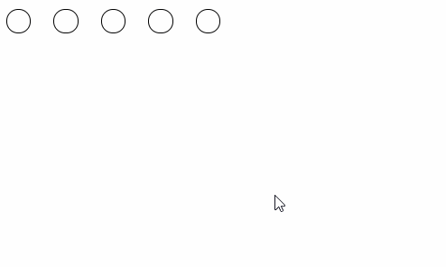
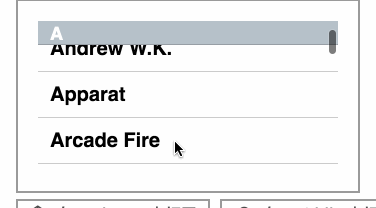

## 前言 
本文由我收集整理了一些前端知识点，参考自各前端大大的博客，github以及各社区的热点题目，前端的知识点多而繁杂，将知识点集中起来温故而知新是极好的，大家觉得有用的话就给个星星吧~

另外，我的博客地址为https://mickey0524.github.io/, 里面有我对一些知识点的详细解读～

## 目录

* [HTML](#HTML) 
* [CSS](#CSS) 
* [JavaScript](#JavaScript)
* [jQuery](#jQuery)
* [Node.js](#Nodejs)
* [移动端](#mobile)
* [webpack](#webpack)
* [有用的网站](#userfulWeb)
* [linux指令](#linux)
* [Vue](#vue)
* [React](#react)
* [Http](#http)

<h2 id="HTML">HTML</h2> 

* Doctype作用？标准模式与兼容模式各有什么区别?

  （1）、<!DOCTYPE>声明位于位于HTML文档中的第一行，处于 <html> 标签之前。告知浏览器的解析器用什么文档标准解析这个文档。DOCTYPE不存在或格式不正确会导致文档以兼容模式呈现。

  （2）、标准模式的排版 和JS运作模式都是以该浏览器支持的最高标准运行。在兼容模式中，页面以宽松的向后兼容的方式显示,模拟老式浏览器的行为以防止站点无法工作。

* HTML5 为什么只需要写` <!DOCTYPE HTML>`？
	
	HTML5不基于SGML，因此不需要对DTD进行引用，但是需要doctype来规范浏览器的行为(让浏览器按照它们应该的方式来运行)
	而HTML4.01基于SGML，所以需要对DTD进行引用，才能告知浏览器文档所使用的文档类型

* HTML空元素

	从前我只知道HTML元素分为块元素和行内元素，还有一种分发是空元素，空元素就是没有内容的元素，必须br，hr，img，input，link，meta
	未来这些元素都要使用/，这是标准写法 `<br />`

* HTML5的离线缓存

	在用户没有与因特网连接的时候，可以正常访问站点或应用，在用户与因特网连接时候，更新用户机器上的缓存文件。
	原理是基于一个新建的.appcache文件的缓存机制(不是缓存技术)
    使用方法是在html标签中添加后缀为manifest的缓存设置文件，一般manifest的名字和对应的html相同即可
```
	<html lang="en" manifest="index.manifest"></html>
	  	CACHE MANIFEST   必要格式
	  	#v0.11                      注释
	  	CACHE:                     需要缓存的部分
	  	js/app.js
	  	css/style.css
	  	NETWORK:                跳过缓存的部分，每次都要向服务器重新获取
	  	resourse/logo.png
	  	FALLBACK:                 当缓存gg的时候，替代的页面
	  	/ /offline.html
```

	可以通过操作js手动更新缓存
	window.applicationCache.update();

* iframe有哪些缺点?

	1.iframe会阻塞主页面的onload事件

	2.搜索引擎的检索程序无法解读这种页面，不利于SEO(search engine optimistion)搜索引擎优化

	3.iframe和主页面共享连接池，而浏览器对相同域的连接有限制，所以会影响页面的并行加载
	使用iframe之前需要考虑这两个缺点。如果需要使用iframe，最好是通过javascript动态给iframe添加src属性值，这样可以绕开上面两个问题

* 自然样式标签和语义样式标签

	Physical Style Elements -- 自然样式标签
	b, i, u, s, pre
	Semantic Style Elements -- 语义样式标签
	strong, em, ins, del, code
	应该准确适用语义样式标签，但不能滥用，如果不能确定时首选使用自然样式标签

* 一次完整的HTTP请求从客户端到服务器端所经过的各个环节
	
	首先，我们要知道HTTP是一个应用层的超文本传输协议，其通信往下走还是TCP那一套，因此什么三次握手啊，通信时候保持TCP连接啊都是这个环节中的部分
	1. 输入域名，浏览器会新开启一个线程去访问DNS服务器，获取与域名相匹配的IP地址
	2. TCP的三次握手，建立TCP链接，形成一个session会话
	3. 浏览器发送request包，服务器接收后对其进行解析，如果请求资源中包含动态语言的内容，服务器会调用动态语言的解释引擎对其进行解析
	4. 请求按router被转发给一个定义好的handle处理，可能包含字符串操作
	5. ssr
	6. 返回response请求
	7. 浏览器会渲染response中的body，接下来就是DOM树的建立，同步解析css，最后就是render页面

* input属性disabled和readonly的区别
	
	readonly只针对input(text/password)和textarea有效，而disabled对于所有的表单元素都有效，但是表单元素在使用disabled后，当我们将表单以post或get方法提交之后，这个元素的值不会被传递出去，而readonly会将该值传递出去，因为当设置为disabled时候，该元素无法获得焦点，而设置为readonly的时候，使能够获得焦点的，因此会被当作form中的一项提交

* https为什么比http更安全

	具体的见http权威指南/图解http，下面给出基本解释
	
	1. http的通信是使用明文不加密的，很可能会被窃听，而https是由http + ssl加密实现的，对通信进行加密
	2. http并不知道实际与其通信的对方是谁，很可能gg，而https使用一种证书的方法，证书由第三方权威机构发布，很难伪造，https通过验证证书，判断对方身份，是否是我们需要通信的目标
	3. http消息传输途中，很可能信息遭到篡改(增加或者删除)，而https能够保证http通信消息的完整性

* 点击图片的某些位置，是可以跳转到你对应的网站的，需要使用到map和area
    
    	
    	<map name="map">
    		<area shape="rect" coords="0, 0, 10, 10" href="https://www.baidu.com" target="_blank">
    	</map>

* html在title中显示小图标的方法

	`<link rel="shortcut icon" href="./webp.ico">`

* 在HTML页面内兼容移动端的操作

    	<meta name="viewport" content="width=device-width, initial-scale=1.0, maximum-scale=1.0, user-saclable=no">

	如果不在HTML页面中加入这句话，css中@media无法根据device-width做兼容，js代码中获取的页面宽度一直为900


* 知道浏览器的requestAnimationFrame这个API么？
	
	requestAnimationFrame在React和Angular中都有使用	

	可能有很多大兄弟觉得transform, keyframe或者transition很好用，当然我也是这么觉得的，然后有一天我看到一个面试题目，大概是往一个ul里面插入30000个li，我想到了documentFragment，用的是setTimeout，然后看了解答发现用的是polyfill，我用的是requestAnimationFrame的备胎！！！

	使用setTimeout的问题是，画面的更新频率要达到每秒60次才能让肉眼看到流畅的动画效果，因为很多浏览器的频率为60HZ，这也是为啥我的setTimeout时间间隔经常使用的是1000 / 60的原因

	下面给出一段由requestAnimationFrame实现进度条由0-100的代码
	
    	var ndProgress = document.getElementById('js-test');
    	var proNum = 0;
    
    	function step () {
    		if (proNum < 100) {
    			proNum += 1;
    			ndProgress.style.width = proNum + '%';
    			ndProgress.innerHTML = proNum + '%';
    			window.requestAnimationFrame(step);
    		}
    	}
    	
    	requestAnimationFrame(step);

	requestAnimationFrame简介：http://www.cnblogs.com/Wayou/p/requestAnimationFrame.html

	requestAnimationFrame polyfill：https://gist.github.com/paulirish/1579671

	让我知道这个api的面试题目：https://zhuanlan.zhihu.com/p/26420034

* 各大浏览器的内核

	1. IE一直使用的是trident
	2. safari, chrome使用的是webkit
	3. opera原来使用的是presto（速度超过了当年的webkit），然后13年后使用blink(webkit的分支)
	4. Firefox使用的是gecko内核

* 在Chrome控制台用dataset设置data-*属性（需要使用驼峰式命名方法，浏览器会自动将其转为data-*形式）

    	$0.dataset.aBC = 1;
    	<div class="" id="lga" data-a-b-c="1">...</div>
    	$0.dataset.aBC;  // 1
    	$0.getAttribute('data-a-b-c'); // 1 

	css中也可以通过自定义data-*属性选中Element
	[data-a-b-c="1"] {
		color: red;	
	}

* DOMContentLoaded

	当初始HTML文档被完全加载解析时，DOMContentLoaded事件被触发，而无需等待样式表、图像和子框架完成加载。另一个不同的事件load应该仅用于检测一个完全加载的页面。在使用DOMContentLoader更加合适的情况下使用load是个非常流行的错误，所以要谨慎

* 在本地当前目录启动静态文件服务器

	可以用于安装apk的文件，当然正道是通过adb shell安装，不过这样暴力省事啊，python -m SimpleHTTPServer 8080 或者全局安装anywhere这个朴灵大大写的库

* target和currentTarget的区别

	target是事件的真实发生节点，currentTarget是绑定事件处理程序的节点

* 内容安全策略(CSP)
	
	预防XSS的一个重要的方法就是配置白名单，CSP就是一种快速的配置白名单的方法

	`meta(http-equiv="Content-Security-Policy" content="script-src 'self' 'unsafe-inline' 'unsafe-eval' www.google-analytics.com")`
	
	上面是一个例子，pug模版写法，self代表本域名的script，unsafe-inline代表内联的script，unsafe-eval用于执行eval(webpack打包出来很多eval。。.) 最后GA的域名是允许使用GA统计

<h2 id="CSS">CSS</h2>

* BFC(Box Formatting Context) 块级格式化上下文

	尝试了一下觉得很好玩

	http://www.cnblogs.com/lhb25/p/inside-block-formatting-ontext.html

	上面这个url中很详细的讲解了有关BFC的栗子和原理

	BFC布局的规则:
	
	  1. 内部的Box会在垂直方向，一个接一个地放置。
	  2. Box垂直方向的距离由margin决定。属于同一个BFC的两个相邻Box的margin会发生重叠
	  3. 每个元素的margin box的左边， 与包含块border box的左边相接触(对于从左往右的格式化，否则相反)。即使存在浮动也是如此。
	  4. BFC的区域不会与float box重叠。
	  5. BFC就是页面上的一个隔离的独立容器，容器里面的子元素不会影响到外面的元素。反之也如此。
	  6. 计算BFC的高度时，浮动元素也参与计算

	哪些元素会生成BFC？
	
	  1. 根元素
	  2. float属性不为none
	  3. position为absolute或fixed
	  4. display为inline-block, table-cell, table-caption, flex, inline-flex
	  5. overflow不为visible     这一条用的最多，设置overflow为hidden就能触发该block成为BFC

	BFC的用处
	上面url中写的非常好
	
	1. 可以用于自适应两栏布局
	2. 可以消除一个BFC中margin重合的问题
	3. 可以清楚内部浮动（因为计算BFC高度的时候，浮动元素也被计算在内）

* 介绍一下标准的CSS的盒子模型？低版本IE的盒子模型有什么不同的?

	盒模型：内容(content) 填充(padding) 边界(margin) 边框(border)
	
	低版本的IE的content部分将border和padding计算了进去

* 经常遇到的浏览器的兼容性有哪些？解决方法是什么，常用的hack技巧?

	1. png24位的图片在ie6浏览器上出现背景，解决方案是做成png8
	2. 浏览器默认的margin和padding不同。解决方案是加一个全局的* { margin: 0; padding: 0 }来统一
	3. ie下，可以使用获取常规属性的方法来获取自定义属性，也可以使用getAttribute()获取自定义属性
	Firefox下，只能使用getAttribute()来获取自定义属性，因此最好使用getAttribute获取自定义属性
	
	4. IE下，event对象有x，y属性，但是没有pageX，pageY属性；Firefox下，event对象有pageX，pageY属性，但是没有x，y属性，很伤
	
	5. Chrome中文界面下默认会将小于12px的文本强制按照12px显示，可通过加入css属性 -webkit-text-size-adjust: none;解决
	
	6. IE兼容hack技术（渐进识别的方式，从总体中逐渐排除局部）
```
	.bb {
	background-color: red; /*所有识别*/
	background-color: #00deff\9; /*IE6，7，8识别*/
	+background-color: #a200ff; /*IE6，7识别*/
	_background-color: #1e0bd1; /*IE6识别*/
	}
```

* 八种创建等高布局的方法

	http://www.w3cplus.com/css/creaet-equal-height-columns

* css中的两栏布局和三栏布局

	http://blog.csdn.net/crystal6918/article/details/55224670

* 为什么要初始化CSS样式

	因为浏览器的兼容问题，不同浏览器对有些标签的默认值是不同的，如果没对CSS初始化往往会出现浏览器之间的页面之间的差异。当然，初始化样式会对SEO有一定的影响，但鱼与熊掌不可兼得，但力求影响最小的情况下初始化
	最简单的初始化方法： * { padding: 0; margin: 0 } (强烈不建议)
	淘宝的样式初始化方法：
```
  body, h1, h2, h3, h4, h5, h6, hr, p, blockquote, dl, dt, dd, ul, ol, li, pre, form, fieldset, legend, button, input, textarea, th, td { margin:0; padding:0; }
  body, button, input, select, textarea { font:12px/1.5tahoma, arial, \5b8b\4f53; }
  h1, h2, h3, h4, h5, h6{ font-size:100%; }
  address, cite, dfn, em, var { font-style:normal; }
  code, kbd, pre, samp { font-family:couriernew, courier, monospace; }
  small{ font-size:12px; }
  ul, ol { list-style:none; }
  a { text-decoration:none; }
  a:hover { text-decoration:underline; }
  sup { vertical-align:text-top; }
  sub{ vertical-align:text-bottom; }
  legend { color:#000; }
  fieldset, img { border:0; }
  button, input, select, textarea { font-size:100%; }
  table { border-collapse:collapse; border-spacing:0; }
```

* CSS里的visibility属性有个collapse属性值是干嘛用的

    对于普通元素visibility:collapse;会将元素完全隐藏,不占据页面布局空间,与display:none;表现相同. 如果目标元素为table,visibility:collapse;将table隐藏,但是会占据页面布局空间. 仅在Firefox下起作用,IE会显示元素,Chrome会将元素隐藏,但是占据空间

* 什么是外边距合并

	外边距合并指的是，当两个垂直外边距相遇时，它们将形成一个外边距，合并后的外边距的高度等于两个发生合并的外边距的高度中的较大者，下面url中详细介绍了外边距合并
	http://www.w3school.com.cn/css/css_margin_collapsing.asp
	
	其实外边距合并就是因为前文讲过的BFC，因此消除外边距合并的办法就是让两个元素处于两个BFC就行了

* 请解释一下为什么需要清除浮动？清除浮动的方式

	清除浮动是为了清除使用浮动元素产生的影响。浮动的元素，高度会塌陷，而高度的塌陷使我们页面后面的布局不能正常显示。
	
	1. 父级div定义height
	2. 父级div也一起浮动
	3. 父级div变为BFC，这样计算高度的时候会把浮动元素算进去
	4. 常规的使用一个class
	```
		.clearfix: before, .clearfix: after {
			content: '';
			display: table;
		}
		.clearfix: after {
			clear: both;
		}	
		.clearfix {
			*zoom: 1;	为了兼容IE触发haslayout
		}

* zoom: 1的清楚浮动的原理

	清楚浮动，触发hasLayout

	Zoom属性是IE浏览器的专有属性，它可以设置或检索对象的缩放比例。解决IE下比较奇葩的问题

	当设置了zoom的值后，所设置的元素就会扩大或者缩小，高度宽度就会重新计算了，这里一旦改变zoom值时其实也会发生重新渲染，运用这个原理，也就解决了ie下子元素浮动时候父元素不随着自动扩大的问题。

* 浏览器是怎样解析CSS选择器的
	
	样式系统从关键选择器开始匹配，何为关键选择器，就是选择器的最后面的部分，如果规则拥有ID选择器作为其关键选择器，则不要为规则添加标签，过滤掉无关的规则，这样速度会变快，话说回来，样式系统从关键选择器开始匹配，然后左移查找规则选择器的祖先元素，只要选择器的子树一直在工作，样式系统就会持续左移，直到和规则匹配，或者是因为不匹配而放弃该规则	

* 元素竖向的百分比设定是相对于容器的高度吗？

	这个知识点很有意思，之前我觉得肯定是相对于容器的高度，后来才知道是要分height和padding-top，margin-top，padding-bottom，margin-bottom这些属性设置百分比的话参照的是容器的宽度而不是高度，很神奇，height属性还是和常理一样参照的是容器的高度。

* 响应式设计的基本原理是什么？如何兼容低版本的IE？

	基本原理是媒体查询 @media

	低版本的IE之所以不支持响应式是因为其不能识别选择器，可以依靠外部js来实现兼容，例如respond.js

* 如何修改chrome记住密码后自动填充表单的黄色背景？

	黄色背景是因为chrome会默认给自动填充的input表单加上input:-webkit-autofill属性

```
	input:-webkit-autofill textarea:-webkit-autofill, select:-webkit-autofill {
		background-color: #FAFFBD;
		background-image: none;
		color: white;	
	}
```

	可以使用足够大的纯色内阴影来覆盖input输入框的黄色背景

```
	input:-webkit-autofill {
		border-shadow: 0 0 0px 1000px white inset;
	}
```

* line-height的一些理解

	如果子元素自己有line-height, 则肯定是和子元素自己的font-size去做相乘得到子元素的line-height

	如果子元素自己没有line-height, 也没有font-size，则无论哪种写法，都是用父亲元素的font-size和line-height去相乘

	如果子元素有font-size没有line-height，则父元素line-height为px直接继承，父元素为%和em，用父元素的font-size和line-height相乘，父元素为数字, 用父元素line-height和子元素的font-size相乘得到子元素的line-height

* 如果要手写动画，你认为最小时间间隔是多久，为什么？

	多数显示器默认频率为60Hz，即1s刷新60次，所以理论上最小间隔为1/60 * 1000ms = 16.7ms

* 什么是CSS预处理器/后处理器

	1. 预处理器例如：less，sass，stylus，用来预编译sass或less，增强了css代码的复用性，还有层级，mixin，变量，循环，函数等，具有很方便的UI组件模块化开发能力，极大的提高了工作效率
	2. 后处理器例如：PostCSS，通常被视为在完成的样式表中根据CSS规范处理CSS，让其更有效；目前最常用的是给CSS属性添加浏览器私有前缀，实现跨浏览器的兼容性问题

* 为什么阿里，腾讯等公司要把图片和css等资源放在单独的域名下？

	1. cookie free，读取这部分资源的时候，没有必要使用cookie，减少很多负载
	2. 负载均衡，便于管理
	3. 制作CDN，一劳永逸，不然图片这些挂在ip地址上的话，万一改了ip就麻烦了

* 回流，重绘以及回流重绘的优化

	http://www.cnblogs.com/nanshanlaoyao/p/5876018.html

* css中opacity和rgba的使用

	假如给父亲元素设置了opacity的话，所有的子元素都会受这个opacity的影响，如果要使得子元素不受父亲元素的限制，可以使用absolute绝对定位将原先的父子布局变为兄弟布局，这样父亲的opacity就不会影响孩子了

	rgba完美解决这个问题，只是ie不支持，就很气，rgba可以用于设置前景色，阴影色等各种颜色

* display为inline-block的元素之间会自动出现间距

	有很多种解决方法

	http://www.zhangxinxu.com/wordpress/2012/04/inline-block-space-remove-%E5%8E%BB%E9%99%A4%E9%97%B4%E8%B7%9D/

	我个人喜欢将父亲元素font-size设置为0，然后孩子元素重新设置font-size

* 前端什么时候用png，什么时候用jpg

	1. png支持透明，jpg不支持透明，需要使用透明的地方必须使用png
	2. png支持无损保存，jpg支持压缩不可逆保存，多次保存后质量会越来越差
	3. png比jpg大的多，能用jpg的地方尽量使用jpg

* 一个浮动元素如何与正常流中的内容发生重叠呢

	这需要用到margin的负值，例如，一个元素 float: left; margin-right: -10px;
	
	这里还有一个关于正常流元素内容显示的问题，当正常流和浮动元素重叠的时候，但是内容的显示就需要按行内元素和块元素区分记忆了

	假如正常流是行内元素，那么正常流的边框，背景和内容都将在浮动元素上面

	假如正常流是块状元素，那么正常流的内容会出现在浮动元素上面，边框和背景则在浮动元素之下

* 关于z-index的一些理解

	有关z-index 的一些理解（包括static / relative / absolute / fixed） 首先，static是默认状态，是不受top，left等和z-index的影响的，这种时候使用margin的负px移动div，会将下方的东西直接覆盖在当前div上 如果是使用relative等，则会先定位，然后再画图，就会使当前的div在下方div的上面

	父亲和孩子拥有相同z-index的时候，孩子会覆盖父亲

	兄弟拥有相同z-index的时候，后面的会覆盖前面的
	
* css属性clip裁剪矩形

	裁剪一个矩形，可以采用rect(top, right, bottom, left)
	
	top，right，bottom，left四个距离为四个方向距离左上角的距离，只能用auto或者长度，不能为百分数，right，bottom可以比父亲元素大，而top和left绝对不允许
	
	clip: rect(0px, 60px, 200px, 0px)

	需要记住的是，需要让这个属性生效的话，元素必须是absolute的

* css图片的预加载和懒加载
	
	http://blog.csdn.net/YiDaShi33/article/details/54316126

	css图片的预加载是在页面渲染之前，提前加载图片，当用户需要查看的时候可以直接从本地缓存中渲染，牺牲效率，提高用户体验

	css图片的懒加载(甚至是不加载)，指的是，将页面中的img标签的src属性设置为一个1px*1px的图片，而将图片真正的url放在标签的自定义属性中，类似data-origin，当图片真正被访问的时候，再将src设置为data-origin，极大的减轻了服务器的压力	

* css属性-伪类和伪元素的区别

	首先给出w3c对两者的定义:
	1. css伪类用于向某些选择器添加特殊的效果 :active :hover :focus等
	2. css伪元素用于将特殊的效果添加到某些选择器 ::before ::after等
	两者都与选择器有关，两者都是为了添加一些特殊的效果
	
* css限制多行，超出部分用省略号表示

	文本溢出我们经常用到的应该就是text-overflow:ellipsis了，相信大家也很熟悉

```
	overflow: hidden;
	text-overflow: ellipsis;
	white-space: nowrap;
```
	但是这种方法并不能支持限制多行，WebKit内核的浏览器实现起来比较简单，可以通过添加一个-webkit-line-clamp的私有属性来实现

```
	overflow : hidden;
	text-overflow: ellipsis;
	display: -webkit-box;
	-webkit-line-clamp: 2;
	-webkit-box-orient: vertical;
```
	如果要做兼容的话，推荐使用clamp.min.js
	http://lomu.me/post/css-multiline-text-overflow

* animation动画

	animation默认是不保留状态的，如果需要的话，可以使用animation-fill-mode:(forwards/backwords/both);

* 用纯CSS实现以下效果，这逆向思维很赞



```js
<!DOCTYPE html>
<html>
<head>
  <meta charset="utf-8">
  <title>JS Bin</title>
</head>
<body>
  <ul>
     <li></li>
     <li></li>
     <li></li>
     <li></li>
     <li></li>
  </ul>
</body>
</html>

*{
  padding:0;
  margin:0;
}

li{
  list-style:none;
  height:20px;
  width:20px;
  border-radius:50%;
  margin:10px;
  border:1px currentColor solid;
}
li:hover,li:hover~li{
  background:gray;
}
ul{
  display:flex;
  direction:rtl;
  width:fit-content;
}

```

* 用纯CSS实现下列效果


```js
<!DOCTYPE html>
<html>
<head>
  <meta charset="utf-8">
  <title>JS Bin</title>
</head>
<body>
  <div>
    <label for="checkbox">
        展示
    </label>
    <input id="checkbox" type="checkbox"></input>
  <div class="modal">
    <label class="close" for="checkbox">关闭</label>
  </div>
  </div>
</body>
</html>

input[type="checkbox"]{
  display:none;
}
label{
  line-height:20px;
  padding:2px 5px;
  background:#aaa;
  font-size:14px;
  color:white;
  box-shadow: 0 0 2px #888888;
}
label:active{
   box-shadow:none;
}
.modal{
  display:none;
  position:fixed;
  top:0;
  bottom:0;
  left:0;
  right:0;
  background:rgba(0,0,0,.3);
}
#checkbox:checked~.modal{
  display:flex;
}
.close{
  margin:auto;
}

```

* CSS position属性的sticky

盒位置根据正常流计算(这称为正常流动中的位置)，然后相对于该元素在流中的 flow root（BFC）和 containing block（最近的块级祖先元素）定位。在所有情况下（即便被定位元素为 table 时），该元素定位均不对后续元素造成影响。当元素 B 被粘性定位时，后续元素的位置仍按照 B 未定位时的位置来确定。position: sticky 对 table 元素的效果与 position: relative 相同。

粘性定位是相对定位和固定定位的混合，元素在跨越特定阈值前为相对定位，之后为固定定位。例如：

`one { position: sticky; top: 10px; }`

在 viewport 视口滚动到元素 top 距离小于 10px 之前，元素为相对定位。之后，元素将固定在与顶部距离 10px 的位置，直到 viewport 视口回滚到阈值以下。

粘性定位常用于定位字母列表的头部元素。标示 B 部分开始的头部元素在滚动 A 部分时，始终处于 A 的下方。而在开始滚动 B 部分时，B 的头部会固定在屏幕顶部，直到所有 B 的项均完成滚动后，才被 C 的头部替代。

须指定 top, right, bottom 或 left 四个阈值其中之一，才可使粘性定位生效。否则其行为与相对定位相同。

```
<div>
  <dl>
    <dt>A</dt>
    <dd>Andrew W.K.</dd>
    <dd>Apparat</dd>
    <dd>Arcade Fire</dd>
    <dd>At The Drive-In</dd>
    <dd>Aziz Ansari</dd>
  </dl>
  <dl>
    <dt>C</dt>
    <dd>Chromeo</dd>
    <dd>Common</dd>
    <dd>Converge</dd>
    <dd>Crystal Castles</dd>
    <dd>Cursive</dd>
  </dl>
  <dl>
    <dt>E</dt>
    <dd>Explosions In The Sky</dd>
  </dl>
  <dl>
    <dt>T</dt>
    <dd>Ted Leo & The Pharmacists</dd>
    <dd>T-Pain</dd>
    <dd>Thrice</dd>
    <dd>TV On The Radio</dd>
    <dd>Two Gallants</dd>
  </dl>
</div>

* {
  box-sizing: border-box;
}

dl {
  margin: 0;
  padding: 24px 0 0 0;
}

dt {
  background: #B8C1C8;
  border-bottom: 1px solid #989EA4;
  border-top: 1px solid #717D85;
  color: #FFF;
  font: bold 18px/21px Helvetica, Arial, sans-serif;
  margin: 0;
  padding: 2px 0 0 12px;
  position: -webkit-sticky;
  position: sticky;
  top: -1px;
}

dd {
  font: bold 20px/45px Helvetica, Arial, sans-serif;
  margin: 0;
  padding: 0 0 0 12px;
  white-space: nowrap;
}

dd + dd {
  border-top: 1px solid #CCC
}
```



* font-boosting现象

	font-boosting是指在android chrome对于高度值为auto的字体进行放大的现象，字体越大越明显。一般通过缩放的页面字体都是原来的2至3倍，所以基本上如果字体高度为auto就会触发font-boosting。解决办法给字体一个高度，通过设置height，max-height，line-height即可

* border-radius中50%和100%的区别

	其实border-radius为50%和100%渲染出来的结果是一样的，50%没啥说的，100%的话浏览器渲染左上角的时候，整个会被渲染成一个1/4圆，渲染右上角的时候，如果按照一样的渲染规则，两个相邻圆角合起来就有200%，浏览器自然不会允许这种事情发生，于是浏览器会重新计算。两个圆角的半径都从100%变成了50%~

	具体细节可以参考这篇知乎文章[border-radius的工作原理](https://zhuanlan.zhihu.com/p/20128284)

<h2 id="JavaScript">JavaScript</h2>

* 如何区分{} 和 [] 

	使用typeof得到的都是object

	最好的方法是使用object原型的toString方法

```
	function isArray(o) {
	    return Object.prototype.toString.call(o) === ‘[object Array]‘;
	}
```

* JavaScript有几种数据类型？

	栈：原始数据类型（Undefined, Null, Boolean, Number, String）

	堆：引用数据类型（对象，数组和函数）

	两种类型的区别是：存储位置不同
	
	原始数据类型直接存储在栈(Stack)中的简单数据段，占据空间小、大小固定，属于被频繁使用数据，所以放入栈中存储

	引用数据类型存储在堆(heap)中的对象，占据空间大、大小不固定。如果存储在栈中，将会影响程序运行的性能。引用数据类型在栈中存储了指针，该指针指向堆中该实体的起始地址。当解释器寻找引用值时，会首先检索其在栈中的地址，取得地址后从堆中获取实体。

* 数组随机排序新姿势get
	
```
	var arr = [1, 2, 3, 4, 5, 6, 7, 8];
	arr.sort(function() {
		return Math.random() - 0.5;	
	});
```

* eval是做什么的？

	它的功能是把对应的字符串解析成JS代码并运行；
	应该避免使用eval，不安全，非常耗性能（2次，一次解析为JS代码，一次执行）

* ['1', '2', '3'].map(parseInt)答案是多少?

	很多人第一眼看到这个问题肯定回答是[1, 2, 3]，但是尝试一下，发现不是这样，是不是觉得很奇怪，就很气，下面我们来分析一下。

	map()函数的参数是一个函数，这个函数的参数为(item, index, array), 在这个等式中，parseInt为map的参数，那么map就会将上书三个参数传给parseInt

	下面我们来分析一下parseInt函数，这个函数可以将2-36进制的字符串转为10进制，它接受2个参数，parseInt(num, scale), 因此map函数传给其的三个参数取前两个参数
	
	1传递过来的参数是 (1,0) 0会被parseInt默认按10进制来计算，因此得到的结果是1
	
	2传递过来的参数是 (2,1) 由于parseInt接受的参数为2-36，因此无法解析，得到的结果是NaN

	3传递过来的参数是 (3,2) 有的小伙伴就会说啦，你看，现在是2-36范围内的值了，为啥还不对，23333，因为3要按2进制来解析，要怎么样解析嘛，因此得到的结果也是NaN

	因此['1', '2', '3'].map(parseInt)得到的答案就是[1, NaN, NaN]，是不是很神奇

* 事件是什么？(给出官方解释)IE和FireFox的事件机制有什么区别?如何阻止冒泡

	我们在网页中的某个操作(有的操作对应多个事件)。例如：当我们点击一个按钮就会产生一个事件，这是可以被Javascript所侦测到的行为。

	IE的事件事件处理只支持冒泡，Firefox的事件处理支持冒泡和捕获

	如何组织冒泡，也需要兼容性的考虑, event.stopPropagation()(旧IE方法 event.cancelBubble = true;)

* new操作符具体干了些什么？

	1. 创建了一个新对象，并且this变量引用该对象，同时还继承了该函数的原型
	2. 属性和方法被加入到this引用的对象中
	3. 新创建的对象由this所引用，并且最后隐式的返回this对象

* Javascript中，有一个函数，执行对象查找时，永远不会去查找原型，这个函数是

	hasOwnProperty

	javascript中hasOwnProperty函数方法是返回一个布尔值，指出一个对象是否具有制定名称的属性，该方法不会去对象的原型链中查找
	
	object.hasOwnProperty(attribute)

	我这有个方法可以判断属性是否为其原型链中的属性
```
	function isPropertyAttr(obj, proName) {
		return !obj.hasOwnProperty(proName) && proName in obj;
	}
```

* [].forEach.call($$("*"),function(a){a.style.outline="1px solid #"+(~~(Math.random()*(1<<24))).toString(16)}) 能解释一下这段代码的意思吗？

	说实话，第一眼看到这么长的代码，肯定是蒙蔽的，所以只能按部就班一步一步分析啦

	$$('*')这是chrome的api，用于获取页面上所有元素，$$('*')相当于document.querySelectorAll('*')，得到一个NodeLists，这不是真正的数组，因此需要采用[].forEach.call来改变this，也可以使用Array.property.forEach.call，前者少些一些代码

	后面代码可以很清晰的看到，是改动css的outline获得彩色轮廓，outline游离于盒子模型之外，因此不会影响元素之前的布局

	1<<24，css中，颜色值为6位16进制值，因此使用Math.random() * (1 << 24)可以得到范围内的一个小数，再采用~~两次取反得到整数部分，最后将10进制的数转为16进制，即大功告成啦2333

* 模块化开发怎么做？

	我一看到这个问题，想到的就是Nodejs的commonjs模块化，模块化将很多地方可能用到的代码块封装起来，隐藏具体的变量和实现方法，暴露出接口。

	然后联想到立即执行函数，reture一个对象变量，暴露出接口
```
	var module = (function() {
		var _count = 0;
		var m1 = function() {
		}
		var m2 = function() {
		}
		return {
			m1 : m1,
			m2 : m2
		}
	})();
```
	这样就暴露除了m1, m2两个接口，隐藏了模块的具体实现

* document.write 和 innerHTML的区别
	
	document.write能够重绘整个页面

    innerHTML能够重构部分页面

* 如何判断当前脚本运行在浏览器还是node环境中?

	`this === window` ? 'brower' : 'node'`
	node中this应该等于global

* 实现一个页面操作不会整页刷新的网站，并且能在浏览器前进、后退时正确响应。给出你的技术实现方案？

	我觉得这道题考的就是ajax干掉浏览器前进后退键的知识点，因为看到题目，首先想到的肯定是ajax优秀的部分刷新机制，然后再往后面看就会想到上面的问题，那么如何解决呢

	1. 加入页面操作改变了URL，可以在每个url后面加上hash，然后监听onHashChange，监听到变化后，重新执行数据拉取
	2. 使用Html5的Hisroty API 具体实现是使用pushState popState window.location.href这几个api
	3. 使用history.js

* 移动端最小触控的区域是多大?

	这个我也不知道，去百度了一下，好像ios是44pt * 44pt，android是48dp * 48dp，下次碰到了有机会再补充

* 把Script标签放在页面的最底部的body封闭之前和封闭之后有什么区别？浏览器会如何解析它们？

	==我以前接触的问题都是把script放在head中还是放在body标签结束之前(阻塞加载的问题)，从结果来看，放在body标签之内和body标签之外并没有什么区别，但是貌似有规则规定过html标签下只能有head和body，其中的script也会被错误修复机制放置到body内部去，有哪位老哥确切知道这个问题，可以告诉小弟一波~

* 移动端的点击事件有延迟，时间是多久，为什么会有？

	click有300ms延迟，为了实现safari的双击事件的设计，浏览器要知道你是不是要双击操作

	我想到最粗暴的方法就是user-scalable=no，禁用缩放美滋滋, 好吧，不扯淡了，正紧的解决方法是使用fastclick这个库，炒鸡好用

* 用js实现千位分隔符？

	这个题目有很多种解决的方法，可以使用三位循环，字符串数组分隔，也可以使用正则，这里我给出正则的实现方式，其他两种较为简单就不给出实现方法了

```
	function changeFormat(num) {
		if (!num) {
			return ;
		}
		num = num.toString();
		return (num.indexOf('.') == -1) ?
			num.replace(/(\d)(?=(\d{3})+$)/g, function($0) {
				return $0 + ',';
			}) :
			num.replace(/(\d)(?=(\d{3})+\.)/g, function($0) {
				return $0 + ',';
			});
	}
	console.log(changeFormat(1234567.90));
	console.log(changeFormat(123123123));
```
	可能有同学会问？=是什么，？=表示正向引用，可以作为匹配的条件，但是匹配的内容不获取，并且作为下一次循环的开始，下面以123123123来分析一下
	第一次(\d)匹配到了3, 因为后面要满足(\d{3})+，后面模式匹配到的是456789，依此类推，匹配到的就是3和6，得到的结果就是123,456,789，需要注意的就是整数匹配时候，由于不像小数一样最后总有.限制条件，需要使用$关闭懒惰匹配，不然得到的就是1,2,3,4,5,6,789

* 我们给一个DOM元素同时绑定两个点击事件，一个用捕获，一个用冒泡。会执行几次事件，会先执行冒泡还是捕获？

	http://www.cnblogs.com/greatluoluo/p/5882508.html
	
	这里需要注意的是所有事件的顺序是：其他元素捕获阶段事件->本元素代码顺序事件->其他元素冒泡阶段事件

	下面来解释一下上面这句话的意思，如果点击的元素是本元素，那么执行的顺序就是捕获事件和冒泡事件定义的先后顺序，那个先定义，哪个就先执行，假如点击的元素是本元素的子元素，那么先执行捕获事件再执行冒泡事件，因为在W3C下，都是先从根元素执行捕获到目标元素，再从目标元素向上执行。

* 列举IE与其他浏览器之间不一样的特性？
	
	1. 其他浏览器事件状态为event，IE中为window.event，为了方便下面统称为event 
	2. 其他浏览器触发事件的目标是event.target，而在IE中则是event.srcElement属性
	3. 获取字符代码，DOM需要使用charCode，而IE需要使用keyCode
	4. 阻止某个事件的默认行为，IE中将returnValue设为false，其他浏览器调用preventDefault()
	5. 停止事件冒泡，IE中设置cancelBubble为true，其他浏览器调用stopPropagation()

* 前端优化的大体思路？

	对普通的网站有一个统一的思路，就是尽量向前端优化、减少数据库操作、减少磁盘IO。
	
	1. 向前端优化指的是，在不影响功能和体验的情况下，能在浏览器执行的不要在服务端执行，能在缓存服务器上返回的不要到应用服务器，程序能直接取得的结果不要到外部取得，本机内能取得的数据不要到远程取，内存能取到的不要到磁盘去，缓存中有的不要去数据库查询。
	2. 减少数据库操作指的是，减少更新次数，缓存结果减少查询次数，将数据库执行的操作尽可能的让你的程序完成(例如join查询)。
	3. 减少磁盘IO指尽量不适用文件系统作为缓存、减少读写文件次数等。
	4. 程序优化永远要优化慢的部分，换语言是无法优化的。

* ajax处理跨域有哪几种方式

	1. 代理：通过后台获取其他域名下的内容，然后再把获取的内容返回到前端，这样在同一个域名下，就不会出现跨域的问题
	2. jsonp
	3. 推荐使用的方法（XHR 2方法）在服务端头部加上允许跨域的标签

* js事件委托（事件代理）

	事件委托就是利用事件冒泡，只指定一个事件处理程序，就可以管理某一类型的所有事件

	http://www.cnblogs.com/liugang-vip/p/5616484.html

	这个博客讲解的非常清楚，事件委托确实和取快递差不多，一个一个dom节点去绑定事件就好比每个人都自己去取快递，而整体绑定到dom节点的父亲节点上，利用事件的冒泡属性去处理事件的话，好比委托前台小姐姐签收，然后小姐姐再去通知你去领取一样

	适合用事件委托的事件 : click, mousedown, mouseup, keyon, keydown, keypress

	mouseover和mouseout虽然也有冒泡属性，但是需要经常计算其位置，也不是很好用

	像focus，blur之类根本就没有冒泡属性的，就更不用说了

* js中的数据类型 typeof instanceof

	js的基本数据类型有String，Number，Boolean，Undefined，Null，Object
	
	typeof是用于判断一个变量或者表达式的类型，typeof一般只能返回如下几个结果

	number，boolean，string，undefined，function，object(array, 对象, null)

	这里有个容易忘记的知识点
	
	`var num = 1; num instanceof Number // false`
	`var num = new Number(1); num instanceof Number // true`
	
	String，Boolean和Number是一样的，Array无论是直接定义还是调用构造函数，都为Array的实例

* document.getElementsByClassName()的兼容问题

	又是IE==, IE6，7，8没有getElementsByClassName方法，因此需要兼容
```
	function getName(obj, cName) {
		var obj = obj || document;
		if (obj.getElementsByClassName) {
			return obj.getElementsByClassName(cName);
		}	
		else {
			var arr = [];
			var all = obj.getElementsByTagName('*');
			for (var i in all) {
				if (all[i].className.indexOf('cName') != -1) {
					arr.push(all[i]);
				}			
			}
			return arr;
		}
	}
```

* caller和callee的区别

	其实caller和callee是风马牛，不相及的两个东西，之所以把这个属性拿来比较记忆，是因为两个属性长的很像

	callee是arguments的一个属性，有两个作用
	
	arguments.callee.length 函数形参的个数
	arguments.callee() 可以用于函数递归调用自身

	arguments.length 函数实参的个数

	caller仅仅是当函数执行的时候才会有用，返回调用该函数的函数，如果是顶层函数调用的话，则返回null

    	var a = function() {
    		alert(a.caller);
    	}
    
    	var b = function() {
    		a();
    	}
    	
    	a() // 弹出null
    
    	b() // 弹出function() { a(); }

* 闭包的出现是基于什么机制的

	那必须是作用域机制，闭包的机制就是一个函数中返回另外一个函数，而返回的这个函数能够访问外围函数的属性，有一些oo的感觉

* window.onload和$(document).ready(function())的区别

	window.onload要等到页面上所有的元素加载完毕才会执行
	
	$(document).ready(function())在DOM树加载完毕的时候就会执行

	$(window).load() === window.onload

* 用setTimeout模拟setInterval

    	setTimeout(function() {
    		do something
    		setTimeout(arguments.callee, 1000);
    	}, 1000);
    	
    	===
    
    	setInterval(function() {
    		do something
    	}, 1000);

* 如何判断浏览器的种类和版本

	navigator.userAgent.indexOf('Chrome') //判断是哪种浏览器
	
	navigator.appVersion //浏览器的版本

	http://www.jb51.net/article/27876.htm

* 严格模式和非严格模式的一些区别

	http://blog.csdn.net/sunshinegirl_7/article/details/49510371
	
	1. 没有with语句，无法延长作用域链
	2. 使用未定义的变量，不再提示undefined，而是报错
	3. 没有caller，argument.callee
	4. 字面量属性重复报错
	5. eval，arguments变为关键字，不能作为变量名字
	6. 一般函数调用的时候，this指向undefined，不指向window

* javascript中的~运算符

    	var num = 25;
    	~num = -26; //也就是说非运算符其实就是原数的负数减去1

	这里小小复习一下，~~num可以对num取整数	

* DOM2的事件处理程序是addEventListener('click', function() {}, false)，这里想挖个坑的话，就问这样写如何清除这个事件处理程序，想当然脱口而出就是removeEventListener，那就完蛋了，**如果addEventListener的处理处理函数是匿名的话，是无法删除的**。

* setTimeout的第三个参数

	setTimeout可以通过第三个参数给其中的延时处理函数传递参数

    	for (var i = 0; i < 5; i++) {
    		setTimeout(function(j) {
    			console.log(j);
    		}, 1000, i);
    	}	
	
	这样的话，会在1s后同时输出0，1，2，3，4，也就证明将最后一个参数i成功传入了第一个函数中

	假如要延时输出0，1，2，3，4
	
    	for (var i = 0; i < 5; i++) {
    		setTimeout(function(j) {
    			console.log(j);
    		}, 1000 * i, i);
    	}

* 考察Javascript的运行机制的题目
	
	https://zhuanlan.zhihu.com/p/25407758

    	setTimeout(function() {
    	  console.log(1)
    	}, 0);
    	new Promise(function executor(resolve) {
    	  console.log(2);
    	  for( var i=0 ; i<10000 ; i++ ) {
    		i == 9999 && resolve();
    	  }
    	  console.log(3);
    	}).then(function() {
    	  console.log(4);
    	});
    	console.log(5);
	
	上面这个代码输出值是什么呢？

	首先碰到一个setTimeout，于是会先设置一个定时，在定时结束后(当前tick结束后)，将传递这个函数放到任务队列里面，因此开始肯定不会输出1。

	然后是一个Promise，里面的函数是直接执行的，因此应该直接输出2，3

	然后，Promise的then应当会放到当前tick的最后，但是还是在当期tick中

	因此，先输出5，再输出4

	最后，到下一个tick，就是输出1

	因此，输出的顺序是 2，3，5，4，1

* JS中变量名作为if条件的真/假
	
	以下情况会被认为返回false，""为空的字符串，为0的数字，为null的对象，为undefined的对象，布尔值false，其他情况下会被认为返回真

* Ajax的优点和缺点

	优点

	1. 页面不同刷新，局部刷新，用户体验好
	2. Ajax全名是异步javascript和xml，使用异步方式和服务器通信，具有更加迅速的响应能力
	3. 可以把以前一些服务端负担的工作转接到客户端，利用客户端闲置的能力来处理，减轻服务器和带宽的负担，节约空间和带宽成本。并且减轻服务器的负担，ajax的原则是"按需取数据"，可以最大程度的减少冗余请求，和响应对服务器造成的负担
	4. 基于标准化的并被广泛支持的技术，不需要下载插件或者小程序。

	缺点
	
	1. ajax干掉了back按钮，即对浏览器后退机制的破坏。后退按钮是一个标准的web站点的重要功能，但是它没法和js进行很好的合作。这是ajax所带来的一个比较严重的问题，因为用户往往是希望能够通过后退来取消前一次操作的。那么对于这个问题有没有办法？答案是肯定的，用过Gmail的知道，Gmail下面采用的ajax技术解决了这个问题，在Gmail下面是可以后退的，但是，它也并不能改变ajax的机制，它只是采用的一个比较笨但是有效的办法，即用户单击后退按钮访问历史记录时，通过创建或使用一个隐藏的IFRAME来重现页面上的变更。（例如，当用户在Google Maps中单击后退时，它在一个隐藏的IFRAME中进行搜索，然后将搜索结果反映到Ajax元素上，以便将应用程序状态恢复到当时的状态。）
	但是，虽然说这个问题是可以解决的，但是它所带来的开发成本是非常高的，和ajax框架所要求的快速开发是相背离的。这是ajax所带来的一个非常严重的问题。
	2. 安全问题
	技术同时也对IT企业带来了新的安全威胁，ajax技术就如同对企业数据建立了一个直接通道。这使得开发者在不经意间会暴露比以前更多的数据和服务器逻辑。ajax的逻辑可以对客户端的安全扫描技术隐藏起来，允许黑客从远端服务器上建立新的攻击。还有ajax也难以避免一些已知的安全弱点，诸如跨站点脚步攻击、SQL注入攻击和基于credentials的安全漏洞等。
	3. 对搜索引擎的支持比较弱。
	4. 破坏了程序的异常机制。至少从目前看来，像ajax.dll，ajaxpro.dll这些ajax框架是会破坏程序的异常机制的。
	5. 另外，像其他方面的一些问题，比如说违背了url和资源定位的初衷。例如，有一个url地址，如果采用了ajax技术，也许在该url地址下面看到的和别人在这个url地址下看到的内容是不同的。这个和资源定位的初衷是相背离的。
	6. 一些手持设备（如手机、PDA等）现在还不能很好的支持ajax，如手机的浏览器上打开采用ajax技术的网站时，它目前是不支持的
	
* 什么时候你不能使用箭头函数？

	https://zhuanlan.zhihu.com/p/26540168

	逛知乎前端周刊看到的一个问题，记录一下。确实，使用箭头函数非常方便，但是乱用箭头函数可能会导致this指向window，然后就gg了。

	1. 定义字面量方法不能使用箭头函数
	2. 定义原型方法不能使用箭头函数
	3. DOM事件的回调函数不能使用箭头函数
	4. 定义构造函数不能使用箭头函数

	具体的例子见上面的URL

* Web 中的一些黑话（2333）

	写论文看到的Vanilla JavaScript，我一看，卧槽，这不是香草Javascript，一查才发现这就是原生Js的意思，然后Polyfill上面已经做过阐述了，就是兼容。

* 原生JS的Object上一些常用的方法（ES5/ES6）

	1. Object.defineProperty()              设置enumerabel等参数
	2. Object.getOwnPropertyDescriptor()    获取对象的一个属性的描述符
	3. Object.getOwnPropertyDescriptors()   获取对象全部属性的描述符
	3. Object.getOwnPropertyNames()         获取对象全部的属性（包括能用for-in遍历的和不能用for-in遍历的）
	4. Object.hasOwnProperty()              判断该属性是否是自己的，而不是原型上的
	5. Object.getOwnPropertySymbols()        获取对象中的symbol
	6. Object.create(proto[, 参数描述符]) 这里参数描述默认是不可枚举的，需要手动显示的将enumerable设为true                      
	7. Object.assign()   只拷贝对象本身的属性，不拷贝对象继承的属性，也不拷贝enumerable为false的属性，使用Object.assign({}, obj)可以拷贝自身对象，假如不想丢失原型上的属性，如下所示
    
    	var origin = Object.getPrototypeOf(obj);

    	var newObj = Object.assign(Object.create(origin), obj);

* 原生JS中的prototype和__proto__的区别
	
	http://rockyuse.iteye.com/blog/1426510
	
	简单来说，这两个属性和原型链的关系都很大，prototype是构造函数的，而__proto__可以看作是对象的一个属性
	
    	function Person() {
    		Person.prototype.say = function() {
    			alert('name');
    		}
    	}
    
    	var person = new Person();
    
    	person.__proto__ === Person.prototype (true)

	其实prototype只是一个假象，他在实现原型链中只是起到了一个辅助作用，换句话说，他只是在new的时候有着一定的价值，而原型链的本质，其实在于__proto__。

* ES6模块和CommonJS模块之间的差异

	首先，他们有两个重大差异

	1. CommonJS模块输出的是一个值得拷贝，ES6模块输出的是值得引用，CommonJS会缓存原始值，内部的变化影响不到输出，除非写成一个函数，才能得到内部变动后的值，而ES6的import有点像Unix系统的“符号链接”，原始值变了，import加载的值也会跟着变化，因此，ES6模块是动态引用，并不会缓存值
	2. CommonJS模块是运行时加载，ES6模块是编译时输出接口，这是由于CommonJS加载的是一个对象，该对象只有在脚本运行完才会生成，而ES6模块不是对象，它的对外接口只是一种静态定义，在代码静态解析阶段就会生成

* CommonJS模块的循环加载

	CommonJS模块发生循环加载的时候不会发送死循环，因为返回的是当前执行的部分的值，因此require()得出的就是一个{}

* 视图数据绑定的原理

	https://segmentfault.com/a/1190000006599500

	http://liuwanlin.info/jian-dan-de-shuang-xiang-shu-ju-bang-ding/

	简单的发布-订阅模式，Vue使用的是数据劫持，在我的github 2017ife的rep中有简单的实现
	
	https://github.com/mickey0524/2017ife/tree/master/vue-learning-5

* JavaScript中的继承

	在ES5，ES6中，继承其实都是基于原型链的操作，ES6中class的extends就是一个语法糖，但是ES5和ES6的this操作顺序是不同的，ES5的继承，其实是先创建子类的this，再通过Parent.apply()添加属性，而ES6的继承则是先创建父亲对象的this，然后再调用子类的构造函数修改this，因此在constructor函数中，必须先调用super()函数

    	class Child extends Parent {
    		constructor (x, y, z) {
    			super(x);
    			this.y = y;
    			this.z = z;
    		}
    	}

* http请求中get和post的区别

	1. get是幂等的操作，post不是幂等的操作
	2. get会将参数跟在url后面进行传递，而post请求则是作为http消息的实体内容发送给web服务器
	3. get请求对传输数据的大小有限制（通常不能大于2KB），而使用post方法传递数据量的上限要比get方法大得多（理论上不受限制）
	4. get方法默认会被浏览器缓存，容易被窃取

* JavaScript既然是单线程的，那么异步要怎么理解？

	所谓单线程，是指负责解释并执行JS代码的线程只有一个，其实还是有很多其他线程的，比如进行Ajax请求的线程、监控用户事件的线程、定时器线程、读写文件的线程（NodeJs中）等等。

	以Ajax来解释异步，主线程执行到发送Ajax的代码时，通知负责处理Ajax请求的线程(不妨叫做Ajax线程)：你给我发个请求吧，我把请求地址和参数都给你了。然后主线程就不管这事了，继续执行后面的代码。等Ajax线程收到HTTP响应的时候，就通知主线程：你的响应来了，快来取吧。主线程在合适的时候就会去取响应，进行适当的处理。

	多说一句，Ajax线程通知主线程的方式就是所谓的事件队列和事件循环机制。	

* JavaScript中可以使用！！来做强制布尔转型

* 请说出if([] == false) { console.log(1); }, if({} == false) { console.log(2); }, if([]) { console.log(3); }的最终结果

	嗯，今天下午，撇了一眼mentor桌上的面试题，看到了这道题，发现不会，深感基础薄弱gg，这道题的答案是1，3

	[] == false，这个比较首先对[]做了valueOf，然后调用toString变为“”，所以[] == false

	同理，String({}) != false

	Boolean([])，当参数为object（排除null，undefined），返回true，详细可以看下方的url

	https://www.h5jun.com/post/why-false-why-true.html

* 函数节流的概念

	我相信很多童鞋，都用过函数节流的方法，但是听到这个名字的时候还是很陌生，嗯，函数节流就是避免响应短时间内发生的类似 resize，mouseover这种事件的技术，使用setTimeout就行啦

* 如何获取当前元素距离页面左上角的坐标

	1. offsetLeft, offsetTop累加
	2. scrollTop同理
	3. getBoundingClientRect().left, getBoundingClientRect().top (这里需要说明一下，getBoundingClientRect()用于得到DOM元素相对视口左上角的距离，这个在feed流之类的滚动页面中很有用，可以用于判断元素是否进入视口，用于记录曝光啥的)

	更多详细的解释见阮一峰大大的博客 http://www.ruanyifeng.com/blog/2009/09/find_element_s_position_using_javascript.html

* 一道前端新人OOP能力测试题

	实现一个前端标签管理器，M是标签容器，N是标签们
	
	要求：
	1. N始终是向左浮动布局，M的宽度可以任意
	2. 编码要求：纯粹的原生JS + CSS，JS要使用面向对象思想
	
	```
	var labels = new Labeler({
		container: '#container',
		data: [ '苹果', '香蕉', '黎' ...]
	});
	
	// 向后追加
	labeler.append('美国开心豆');
	
	labeler.prepend('日本豆腐');
	
	labeler.delete('香蕉');
	```
	
* 使用CDN的好处

	最近在做项目的时候，webpack打包出来的图片8192大小下的都会被转为base64编码的形式，而该大小之上的会被打包成单独的文件放在img文件下，这个时候就有两种选择方式了，设置publicPath，一种是让线上代码访问public目录，另外一种就是上传CDN，让线上代码访问CDN服务器，下面给出CDN的好处
	
	1. 访问速度有保障，稳定性也能提高
	2. 负载均衡
	3. cookie清除，避免访问静态文件的时候，也带上成堆的cookie
	4. 省下资源服务器的一部分资源负担，节省空间节省流量

* 实现一个flatten函数，将一个嵌套多层的数组 array（数组） (嵌套可以是任何层数)转换为只有一层的数组，数组中元素仅基本类型的元素或数组，不存在循环引用的情况。 Ex: flatten([1, [2], [3, [[4]]]]) => [1, 2, 3, 4]

```js
/*方法1*/
function flatten(arr){
  var newArr = []
  function _flat(arr){
    arr.forEach(val=>{
      if(Array.isArray(val)){
        _flat(val)
      }else{
        newArr.push(val)
      }
    })    
  }
  _flat(arr)
  return newArr
}

/*方法2*/

function flatten2(arr){
  return arr.reduce(function(initArr, currentArr){
    return initArr.concat(Array.isArray(currentArr)?flatten2(currentArr):currentArr)
  }, [])
}

```

* 实现一个reduce函数，作用和原生的reduce类似，reduce(list, iteratee, [memo])，memo是reduce函数的初始值，会被每一次成功调用iteratee函数的返回值所取代 。这个迭代传递4个参数：memo,value 和 迭代的index和最后一个引用的整个 list。如果没有memo传递给reduce的初始调用，iteratee不会被列表中的第一个元素调用。第一个元素将取代memo参数传递给列表中下一个元素调用的iteratee函数。

```js
function reduce(list, f, initValue) {
    let res = initValue ? initValue : list[0];
    let index = initValue ? 0 : 1;
    for (let i = index, len = list.length; i < len; i++) {
        res = f(res, list[i]);
    }
    return res;
}
```

* 实现一个map函数，模拟原生的map函数，map(list, iteratee)，通过对list里的每个元素调用转换函数(iteratee迭代器)生成一个与之相对应的数组。iteratee传递三个参数：value，然后是迭代 index。

```js
function map(list, iteratee) {
    let result = [];
    for (let i = 0, len = list.length; i < len; i++) {
        result.push(iteratee(list[i], i, list));
    }
    return result;
}
```

* getComputedStyle的用法

	不知道这个函数的用法之前，只用能过DOM.style获取定义在标签内部的样式，而window.getComputedStyle()方法能够给出活动样式表之后的元素的所有CSS属性的指，这就很舒服了，不过需要注意的是，解析这些值可能包含基本的计算，举个例子，移动端width和height的rem数值为小数的话，DOM.offsetWidth和getComputedStyle(el).width获得的数值是不一样的～

* initial-scale兼容性

	initial-scale在中低端android机并不完全支持，所以动态缩放之后布局视窗大于虚拟视窗，导致出现横向滚动条。移动端动态生成meta标签之后，判断window.innerWidth和document.documentElement.clientWidth，如果后者大于前者，则需要再次修改meta标签，制定width=window.innerWidth，伪代码如下:

```
docElem.getBoundingClientRect().width > win.innerWidth ? res.changeScale() : res.changeScale("initial");    
 ...      
var metaWidth = this.scale == '1.00' ? 'device-width' : win.innerWidth;
       metaElem.setAttribute("content", "width="+metaWidth+",initial-scale=" + this.scale + ", maximum-scale=" + this.scale + ", minimum-scale=" + this.scale + ", user-scalable=no");
```

* [].reduce(Math.pow)

	这个语句会抛出TypeError，原因是reduce on an empty array without an initial value throws TypeError

* 下面的函数会返回什么？

```
var name = 'World!';
(function() {
	if (typeof name === 'undefined') {
		var name = 'Jack';
		console.log('Goodbye ' + name);
	} else {
		console.log('Hello ' + name);	
	}
})();
```

第一眼看过去，惯性思维，name会按作用域链向上访问，于是name = 'world'，那就gg了，这里隐藏了一个变量提升的问题，上面的代码等同于

```
var name = 'World!';
(function() {
	var name;
        if (typeof name === 'undefined') {
                name = 'Jack';
                console.log('Goodbye ' + name);
        } else 
             console.log('Hello ' + name);
	}
})();
```

这就一目了然了，因此，会输出Goodbye Jack

* 这个语句的结果是啥呢？

```
var END = Math.pow(2, 53);
var START = END - 100;
var count = 0;
for (var i = START; i <= END; i++) {
    count++;
}
console.log(count);
``` 

答案是这是一个无限循环，JavaScript能够安全的表达[-2^53 + 1, 2^53 - 1]范围内的数，2^53是能表达的最大的不安全的数值，超过这个数值都会转为2^53，因此上面是一个无限循环

* 下面语句的结果是啥？

```
var ary = [0,1,2];
ary[10] = 10;
ary.filter(function(x) { return x === undefined;});
```

不会为缺少的元素调用filter方法

* JavaScript精度一直存在问题，不光是小数存在问题，大数计算的时候也存在问题

0.8 - 0.6 != 0.2，emmmmmm

```
var a = 111111111111111110000,

    b = 1111;
    
a + b = 111111111111111110000;
```

* Array.prototype是一个数组

Array.isArray( Array.prototype ) = true

* 3.toString()报错，3..toString() == '3'

* 下面这个语句返回啥呢？

`"1 2 3".replace(/\d/g, parseInt)`

其实调用parseInt的是[1, 0], [2, 2], [3, 4]，分别为匹配项和index

因此这个语句得到的结果是[1, NaN, 3]

* 下面这个问题返回啥呢？

```
var lowerCaseOnly =  /^[a-z]+$/;
[lowerCaseOnly.test(null), lowerCaseOnly.test()]
```

正则匹配的话，执行的事...test('null')和...test('undefined')

* 使用chrome devtool调试代码的办法

	http://www.css88.com/archives/8175

* 浏览器端的Object.assign()兼容性并不好，需要使用插件才能使用，这里用原生js实现Object.assign()的兼容写法

```js
var _extend = Object.assign || function(target) {
	for (var i = 1; i < arguments.length; i++) {
		var source = arguments[i];
		for (var key in source) {
			if (Object.prototype.hasOwnProperty.call(source, key)) {
				target[key] = source[key];
			}	
		}
	}
	return target;
}
``` 

* 当用户关闭了JavaScript，可以通过`<noscript>开启JavaScript，获得更好的体验</noscript>`来提示用户

* 简单的js响应式初始化代码

```js
var documentElement = document.documentElement;
function callback() {
	var clientWidth = documentElement.clientWidth;
	// 屏幕宽度大于780，不再放大
	clientWidth = clientWidth < 780 ? clientWidth: 780;
	documentElement.style.fontSize = clientWidth / 10 + 'px';
}

document.addEventListener('DOMContentLoaded', callback);
window.addEventListener('orientationchange' in window ? 'orientationchange' : 'resize', callback);
```

* javaScript中的in操作符

	记录这个知识点是为了不和python混淆，python中的in操作符可以用来判断字串是否存在于字符串中，元素是否存在于数组中，key是否存在于dict中，然而在js中，in最好只用于判断key是否存在于对象中，当in用于数组的时候，其实判断的是索引是否存在，其实很好理解，arr是可遍历的(iterable)，可以理解为一个index: value的健值对，参照对象，用于判断的自然就是index了。

* javaScript中的document.documentElement.scrollTop，document.body.scrollTop以及window.pageYOffset之间的异同

	window.pageYOffset 在IE9版本之下不兼容，IE6，7，8支持document.documentElement.scrollTop，但是document.body.scrollTop与document.documentElement.scrollTop两者有个特点，就是同时只会有一个值生效，比如document.body.scrollTop能取到值的时候，document.documentElement.scrollTop就会始终为0，反之亦然，因此可以按照如下的写法

	window.pageYOffset || document.documentElement.scrollTop || document.body.scrollTop 

<h2 id="jQuery">jQuery</h2>

* jQuery中jQuery和jQuery.fn的区别

	你可以把jQuery理解为jQuery的类，把jQuery.fn理解为jQuery的实例(那些通过jQuery选择器选择的元素都可以理解为jQuery的实例)

* jQuery.fn的init方法是否返回的this是指什么对象？为什么要返回this？

	当你使用jQuery去生成jQuery实例也就是$()的时候，你也就调用了jQuery.fn.init方法，其返回的this自然就是你找到的元素了，即jQuery.fn.init的实例，也就是一个类数组对象，至于为什么要返回this，不返回this，无法进行后续对jQuery元素的操作啊23333.

* jQuery中如何将数组转化为json字符串，然后再转化回来?

	我印象中好像是没有这个方法，下次发现了再更新啦

```
	$.fn.stringifyArray = function(array) {
		return JSON.stringify(array);	
	}

	$.fn.parseArray = function() {
		return JSON.parse(array);	
	}
```
	这样就给jQuery的实例添加了两个方法，`$("").stringifyArray(array)`这样使用就行

* 针对jQuery的优化方法？

	1. 基于class的选择器性能行对于ID选择器开销大得多，因为需要遍历所有DOM元素，因此，能用ID选择器的就不要用class选择器
	2. 频繁操作的DOM，先缓存起来再操作，用jQ的链式调用更好，反正我平时就特别喜欢链式调用233，我个人觉得链式调用更加清晰
	3. `for (var i = size, len = arr.length; i < length; i++)`for循环每一次都查找了arr数组的长度，如果在循环过程中长度不变的话，可以使用一个变量将其保存，这样循环可以跑的更快

* $.extend()和$.fn.extend()的区别?
	
	上面有个题目讲到$是jQuery类，$.fn是jQuery实例，然后我们又知道extend是扩展方法，那么自然而然就能理解$.extend()扩展的是jQuery类的方法，可以理解为jQuery类的静态方法，$.fn.extend()自然就是扩展jQuery实例的方法，下面举两个栗子来加强记忆

```
	$.extend({
		minValue: function(a, b) { return a > b ? b : a }
	})
	$.minValue(1, 2); //1

	$.fn.extend({
		sayHello: function() {
			console.log('Hello');
		}	
	})
	$('#id').sayHello();  //$.fn是实例，那么该方法只能是实例来调用，$.sayHello会报错
```

* jQuery的属性拷贝(extend)的实现原理是什么，如何实现深拷贝?

	看到这里，可能会有疑问，上面一个问题明明讲了$.extend()就是为JQuery类扩展方法的，这里又说道属性拷贝，其实没有冲突，上文只是为了抓住重点进行解释。

	$.extend(boolean, target, object1, object2)

	第一个boolean值是指定是否采用深拷贝的标志，可以显示的指示为true，不能显示的指定为false，假如不用深拷贝的话，这个属性不赋值就行；

	target是进行属性拷贝的源对象，加入未定义，就默认为jQuery

	object1/object2即为一个一个的对象，后面对象中假如有和前面对象重复的定义，则后面的覆盖前面定义的属性

* jQuery的队列是如何实现的？队列可以用在哪些地方？

	说实话，我之前也没有用过jQuery的队列，正好借此机会，学习了一下关于队列的方法

	jQuery中，jQuery和jQuery.fn中都有queue相关的api，需要牢记的一点是队列中只能存函数

	首先我们看一下jQuery类中的队列

```
	function aaa() {
		alert(1);
	}

	function bbb() {
		alert(2);
	}

	$.queue(document, "q1", aaa);  //在document中创建一个队列q1，并往q1中添加aaa函数
	$.queue(document, "q1", bbb);  //在document下q1队列中添加bbb函数
	$.queue(document, "q1", [aaa, bbb]) //和上方代码效果一样，只是合起来写
	
	$.dequeue(document, "q1")  //取出document下q1队列中第一个函数并执行
``` 
	下面我们看一下jQuery实例中的队列

```	
	$(document).queue("q1", aaa); //入队
	$(document).dequeue("q1") //出队
	$(document).clearQueue("q1") //清空队列
```	
	至于队列有什么作用呢，大家可以想想，在接触jQuery动画的时候，是不是有动画依次执行的例子

```
	$(this).animate({ width: 300 }, 2000).animate({ left: 300 }, 2000);
```

* 谈一下jQuery中的bind(), live(), delegate(), on()的区别?

	bind()方法用来给当前已经存在的元素绑定事件处理函数(click, change等)，我个人喜欢用click()这样的写法

	live()，delegate()，on()我认为他们的作用是用来给当前还未被添加到DOM中的元素绑定事件处理函数，他们使用的都是事件委托原理，其中live()效率底下已经被废弃

	$('selector').live(type, callback) //live是使用document的事件委托，因此效率非常低
	
	$('parent').delegate(selector, type, callback) //delegate使用的是父亲元素的事件委托

	$('parent').on(type, selector, callback) 

* jQuery的slideUp动画，如果目标元素是被外部事件驱动，当鼠标快速地连续触发外部元素事件，动画会滞后的反复执行，该如何处理呢？

	利用stop()方法，如`$('#div').stop().animate({ width: 100 }, 100)`

	这里再回忆一下jQuery的stop()方法

	stop(): 停止当前执行的动画，如果动画存在队列的话，只能停止当前的，无法停止后续的动画队列

	stop(true)：停止当前执行的动画随后所有动画，且不会跳转到当前动画的终态

	stop(true, true)：停止当前执行的动画随后所有的动画，然后跳转到当前动画的终态，要记住，jQuery是无法跳转到动画队列最后一个动画的终态的，无论什么方法都不行

* jQuery一个对象可以同时绑定多个事件，这是如何实现的？

	1. 多个事件同一个函数：`$('div').bind('click change', function() {});`
	2. 多个事件不同函数：
	```
		$('div').bind({
			click: function() {},
			change: function() {}
		})
	```

* 使用jQuery，找到id位selector的select标签中有用data-target属性为isme的option的值

    `$('#selector option[data-target=isme]')`

* 需要注意的是$('#id')获取的永远是对象，因此不能用if($('#id'))来判断，可以使用if($('#id').length > 0)或者if($('#id')[0])来判断

* jQuery的遍历方法each中的index不能省略

* jQuery的ajax操作在最后可以增加一个always操作，这样无论返回的结果是success还是error，都要执行该always中的语句

    	$.ajax({
    	}).always(function() {
    		... //必须执行的代码
    	})

<h2 id="Nodejs">Node.js</h2>

* 都说Node.js是单线程，这是真的吗？

	对，也不对。可以参考浏览器里的script来理解，浏览器端的javascript是单线程的，但是为什么我可以同时发送一堆ajax请求，还能响应DOM事件，是谁在调用这些回调？答案很简单，宿主环境。虽然javascript代码本身是单线程执行的，但是浏览器是多线程的。Node.js也一样，虽然你写的代码是单线程的，但是Node.js本身会有一堆线程干别的事。

* 入坑Node.js的同学多半是听说Node.js高并发、性能好，这是对的吗？

	对，也不对。高并发是对的，性能因为V8的强大，相对于脚本语言（php，python）来说会有优势，但是绝对的性能（C++、Java、Go）肯定谈不上好

* 性能不好怎么还高并发呢，这不是矛盾了吗？

	并不矛盾，高并发并不意味着快，只代表Server能同时接受多少请求，但管杀不管埋，每个请求接进来之后能不能快速的处理掉，还是跟你的代码有关。所以当你的代码是CPU密集的时候，请慎用Node.js。Node.js的优势在与IO密集的场景能更多的压榨单机的性能。

* js 中， 0.1 + 0.2 === 0.3 是否为 true ? 在不知道浮点数位数时应该怎样判断两个浮点数之和与第三数是否相等？

	答案肯定是不为true的，因为Javascript的number类型按照ECMA的Javascript标准，它的Number类型就是IEEE 754的双精度数值，因此Javascript在做四则运算的时候，精度会丧失

	至于后面这个问题，我的话，会采用这个方法
	```
		if (Math.abs(num1 - num2) < 1E-10) {
			// do something
		}
	```

* a.js和b.js两个文件互相require是否会死循环？双方是否能导出变量？如何从设计上避免这种问题？

	不会的，下面给出require的实现机制

    	function require(...) {
    		var module = { exports: {} };
    		((module, exports) => {
    			function some_func() {};
    			exports = some_func;
    			module.exports = some_func;
    		})(module, module.exports);
    		return module.exports;
    	}
	从上面的实现代码也可以看出exports就是module.exports的一个引用，具体这两个之间的关系见下方url https://cnodejs.org/topic/5734017ac3e4ef7657ab1215

* Event是Nodejs中一个非常重要的core模块，在node中有许多重要的core API都是依赖其建立的.比如Stream是基于Events实现的，下面我们来看几段event相关的代码

    	const EventEmitter = require('events');
    
    	let emitter = new EventEmitter();
    	
    	emitter.on('myEvent', () => {
    	  console.log('hi 1');
    	});
    	
    	emitter.on('myEvent', () => {
    	  console.log('hi 2');
    	});
    	
    	emitter.emit('myEvent');

	上方的代码会依次输出hi 1和hi 2

	const EventEmitter = require('events');

    	let emitter = new EventEmitter();
    	
    	emitter.on('myEvent', () => {
    	  console.log('hi');
    	  emitter.emit('myEvent');
    	});
    	
    	emitter.emit('myEvent');

	上方代码会死循环，道理也很简单，第一次监听到了myEvent，然后又发出了myEvent的信号，这个是全局的，继续监听，然后就死循环了

	const EventEmitter = require('events');

    	let emitter = new EventEmitter();
    	
    	emitter.on('myEvent', function sth () {
    	  emitter.on('myEvent', sth);
    	  console.log('hi');
    	});
    	
    	emitter.emit('myEvent');

	这样就不会死循环，因为第二次监听之后，已经没有发出myEvent事件了

* 用js实现一个sleep函数？

	Nodejs中执行js代码的过程是单线程的，只有当前代码都执行完，才会切入事件循环，然后从事件队列中pop出下一个回调函数开始执行代码，所以实现一个sleep函数，只要通过一个死循环就可以阻塞整个js的执行流程
    
    	function sleep(ms) {
    		var start = Date.now(), expire = start + ms;
    		while (Date.now() < expire) { }
    		return ;
    	}

* Child Process中child.kill和child.send的区别

	child.kill是基于信号系统，child.send是基于IPC通道

* 父进程或子进程的死亡是否会影响对方？什么是孤儿进程？

	子进程死亡不会影响父进程，不过子进程死亡时，会向它的父进程发送死亡信号，反之父进程死亡，一般情况下子进程也会随之死亡，但如果此时子进程处于可运行状态的话，子进程将被init进程收养，从而成为孤儿进程，另外，子进程死亡的时候，父进程没有及时调用wait()或者waitpid()来返回死亡进程的相关信息，此时子进程还有一个PCB残留在进程表中，被称为僵尸进程

* 初识cluster

	Cluster是最常见的Node.js利用多核的办法，它是基于child_process.fork()来实现的，所以cluster产生的进程之间是通过IPC来通信的，并且它也没有拷贝父亲进程的空间，而是通过加入cluster.isMaster这个标识来区分父亲进程还是子进程

    	const cluster = require('cluster');
    	const http = require('http');
    	const numCPUs = require('os').cpus().length;
    
    	if (cluster.isMaster) {	
    		for (var i = 0; i < numCPUs; i++)
    			cluster.fork();
    		}
    		cluster.on('exit', (worker) => {
    			console.log(`${worker.process.pid} died`);
    		});
    	}
    	else {
    		http.createServer((req, res) => {
    			res.writeHead(200);
    			res.end('hello world\n');
    		}).listen(8000);
	在上述代码中 numCPUs 虽然是全局变量但是, 在父进程中修改它, 子进程中并不会改变, 因为父进程与子进程是完全独立的两个空间. 他们所谓的共有仅仅只是都执行了, 并不是同一份.
	
	你可以把父进程执行的部分当做 a.js, 子进程执行的部分当做 b.js, 你可以把他们想象成是先执行了 node a.js 然后 cluster.fork 了几次, 就执行执行了几次 node b.js. 而 cluster 模块则是二者之间的一个桥梁, 你可以通过 cluster 提供的方法, 让其二者之间进行沟通交流.

	一般都会把处理逻辑封装成一个app.js，那么在else里面require('./app.js')是个不错的选择

	最后大力推荐一下pm2管理，pm2 start app.js -i 4 起4个工作进程

* 父进程和子进程之间的IPC通道是怎么建立的?
	
	在通过 `child_process` 建立子进程的时候，是可以指定子进程的env(环境变量)的，所以Node.js在启动子进程的时候，主进程会先建立IPC通道，然后将IPC通道的fd(文件描述符)通过环境变量(NODE_CHANNEL_FD)的方式传递给子进程，然后子进程通过fd连上IPC与父进程建立连接

* 如何创建一个Buffer对象，知道new Buffer()被逐渐废弃了么，知道为什么吗？

	ps: 对buffer对象使用typeof得到的是object

	在Node.js v6.x之前，我们创建buffer对象使用的都是new Buffer()的方法，但是在此之后，该方法开始被废弃，理由是参数类型不同会返回不同类型的Buffer对象，所以当开发者没有正确校验参数或没有正确初始化Buffer对象的内容时，以及不了解的情况下初始化就会在不经意间向代码中引入安全性和可靠性问题。

	因此当前的方法是

	`Buffer.from()` 根据已有数据生成一个Buffer对象

	`Buffer.alloc(size)` 创建一个大小为size的Buffer对象

* 自己实现一个console.log()

    	let print = (str) => process.stdout.write(str + '\n');
    	
    	print('hello world');

* Nodejs如何同步的获取用户的输入

	在Nodejs中，输入流 (stdin), 输出流 (stdout), 错误流 (stderr) 三者. 在 Node.js 中分别对应 process.stdin (Readable), process.stdout (Writable) 以及 process.stderr (Writable) 三个 stream.

	下面给出stackoverflow上的实现方法

	    /*
    	 * http://stackoverflow.com/questions/3430939/node-js-readsync-from-stdin
    	 * @mklement0
    	 */
    	var fs = require('fs');
    	
    	var BUFSIZE = 256;
    	var buf = new Buffer(BUFSIZE);
    	var bytesRead;
    	
    	module.exports = function() {
    	  var fd = ('win32' === process.platform) ? process.stdin.fd : fs.openSync('/dev/stdin', 'rs');
    	  bytesRead = 0;
    	
    	  try {
    	bytesRead = fs.readSync(fd, buf, 0, BUFSIZE);
    	  } catch (e) {
    	if (e.code === 'EAGAIN') { // 'resource temporarily unavailable'
    	  // Happens on OS X 10.8.3 (not Windows 7!), if there's no
    	  // stdin input - typically when invoking a script without any
    	  // input (for interactive stdin input).
    	  // If you were to just continue, you'd create a tight loop.
    	  console.error('ERROR: interactive stdin input not supported.');
    	  process.exit(1);
    	} else if (e.code === 'EOF') {
    	  // Happens on Windows 7, but not OS X 10.8.3:
    	  // simply signals the end of *piped* stdin input.
    	  return '';
    	}
    	throw e; // unexpected exception
    	  }
    	
    	  if (bytesRead === 0) {
    	// No more stdin input available.
    	// OS X 10.8.3: regardless of input method, this is how the end 
    	//   of input is signaled.
    	// Windows 7: this is how the end of input is signaled for
    	//   *interactive* stdin input.
    	return '';
    	  }
    	  // Process the chunk read.
    	
    	  var content = buf.toString(null, 0, bytesRead - 1);
    	
    	  return content;
    	};

* path模块中path.resolve()和path.join()的区别

	在很多环境下，path.resolve()和path.join()会返回相同的数值，看一看下面这个例子

```js
path.join('a', 'b1', '..', 'b2') === 'a/b1/../b2'
path.resolve('a', 'b1', '..', 'b2') === 'a/b2'
```

	一目了然，path.join就是用/将参数连接起来，而path.resolve返回的是执行操作最后的目录

<h2 id="mobile">移动端</h2>

* 移动端有关touch的事件

	touchstart, touchmove, touchend(移动端监听用户手势事件)

* dpr和移动端适配

	http://www.w3cplus.com/mobile/lib-flexible-for-html5-layout.html

	一般计算dpr和font-size都是动态在html上使用dataset去设定的

* 网上都说操作真实 DOM 慢，但测试结果却比 React 更快，为什么？

	参照知乎yyx大大的回复 https://www.zhihu.com/question/31809713/answer/53544875

* android机器经常不能高度居中，但是IOS和chrome devtool明明是居中的，是不是很痛苦？
	
	首先，尽量不要使用奇数的px，android对小数不敏感，其次，由于IFC的原因，不同android height和line-height的基准是不一样的，可以试着把height去掉，让line-height自动撑起高度，这样有助于在android上实现高度居中

* 移动端不能识别 $('html, body').scrollTop, 单纯就是因为moblie ios 不认识$(‘html,body’)，改成$('body')就好

	http://blog.jonathanargentiero.com/jquery-scrolltop-not-working-on-mobile-devices-iphone-ipad-android-phones/

* 响应式布局（类似flexible的rem计算方式）手机字体大小会影响app中的webview元素的大小

	这个简直是天坑，和组内的大佬找了2个多小时吧，最后定位到是手机字体的大小会影响webview元素的大小，大部分手机的默认字体大小是16px，这个大小不会有问题，三星默认大小比16px大一号，结果计算出来的元素均会偏大，难受的一匹，解决方法是可以让客户端将字体大小写死为16px，允悲	

* Android浏览器文本垂直居中问题

	android浏览器上下居中始终存在问题，苹果浏览器是没有问题的，解决问题的方法是使用table布局

```
<div class="container">
	<div class="sub-container">居中</div>
</div>

.container {
	display: table;
        width: 100px;
        height: 100px;
}
.sub-container {
        text-align: center;
        display: table-cell;
        width: 40px;
        height: 40px;
        vertical-align: middle;
}
```

* CSS3 动画在 iOS 上为什么会因为页面滚动也停止

	最近在做移动端的feed流的时候，发现一个现象，当手指按住屏幕，触发touch事件的时候，ios手机是不会响应任何操作的，包括（接口，动画...），当时百思不得其解，以为是bug，后来发现，ios为了流畅度，将touch事件放在监听的第一位，详情可以参考下面的连接

[CSS3动画在ios上为什么会因为页面滚动而停止](https://www.zhihu.com/question/24268253)

<h2 id="webpack">webpack</h2>

* webpack插件大全

	https://webpack.js.org/plugins/

* webpack优秀中文文章
	
	https://github.com/mickey0524/awesome-webpack-cn

* webpack与flexbile.js配合实现自适应

	webpack在处理样式打包的时候在less,sass等loader之前，在style-loader，css-loader之后，使用postcss-loader，配置postcss-pxtorem，就能将按照设计稿设计的px属性转为自适应的rem属性 https://github.com/cuth/postcss-pxtorem	

<h2 id="userfulWeb">有用的网站</h2>

* 阿里妈妈icon	

	http://www.iconfont.cn/search/index?searchType=icon&q=dot&page=1 可以在这个网站上找到很多切图

* caniuse
	
	https://caniuse.com/ 可以在这个网站上查询HTML5和CSS最新属性的兼容性

* JavaScript资源中文大全

	https://github.com/jobbole/awesome-javascript-cn

* 一些移动端非常好用的插件(layzr.js / swiper等)

	https://github.com/jawil/blog/issues/10

* npms.io，用于查询node packages，比npmjs好用的地方在于他会对包本身进行评估，通过用户人数，包活跃度等等进行评分，给予开发者参考

	https://npms.io

<h2 id="linux">linux指令</h2>

* lsof -i:port

	在开发过程中，经常出现端口被占用的情况，使用这个指令可以检测端口是否被占用

<h2 id="vue">Vue</h2>

* 修改Vue对象数组中数组，view层不生效，原因是没有使用$set，直接修改并不会给你重新渲染

	 array.$set(index, {})

* 修改Vue对象数组的元素的一个字段，直接赋值是不行的，Object.assign(原对象，{ key: value })也是不行的，因为这个操作默认是浅拷贝

	使用Object.assign({}, 原对象, { key: value })是可以的

* Vue中，尽量不要使用箭头函数，像methods中的方法，watch中的方法，箭头函数绑定了父级作用域的上下文，所以this不会按照期望指向Vue实例

* Vue的生命周期简介

	Vue在初始化组件数据的时候，在生命周期的beforeCreate和created钩子函数之间实现了对data、props、computed、methods、events以及watch的处理，在渡过created生命周期之后，Vue会去判断options对象中是否包括el这个key，如果不存在就要等待instance.$mount()手动进行挂载(instance 是由extend创建的构造器实例化出来的实例)，紧接着，Vue会去判断是否存在template或者render，存在的话，用template进行编译，反之，将el的outerHTML作为template进行编译，然后就是mounted()进行挂载... 

* 计算属性的setter

	计算属性默认只有getter，不过在需要时你也可以提供一个setter:

	```js
	computed: {
 		fullName: {
   			 // getter
   			 get: function () {
     				 return this.firstName + ' ' + this.lastName
   			 },
   			 // setter
   			 set: function (newValue) {
     				 var names = newValue.split(' ')
     				 this.firstName = names[0]
     				 this.lastName = names[names.length - 1]
   			 }
 		 }
	}
	```
	
	注意这里，Vue中是可以通过修改计算属性，以及设置set来反向修改计算属性依赖的data

* vue中，在计算属性能够解决的问题作用范围内，尽量使用计算属性，但是需要注意的一点是，计算属性是同步的，有时候需要异步的修改，这个时候可以使用watch。

<h2 id="react">React</h2>

* 在react虚拟内存中获取DOM元素的方法

	原先的this.refs.nodeName会有问题，现在官方提供了回调函数的新用法，未来可能会把refs这种旧的API下掉

	`<input type="text" ref={(input) => { this.textInput = input; }}  />`

	通过这种方法，就把该DOM元素绑定在了this.textInput上23333

* React中类型检查的方法

	Vue中可以直接在props中进行类型检查，React中自然也有相应的类型检查方法，但需要注意的是，React.PropTypes自React v15.5起已弃用，请使用prop-types库代替
	
	```
	import PropTypes from 'prop-types';
	
	class Greeting extends React.Component {
	  render() {
	    return (
	      <h1>Hello, {this.props.name}</h1>
	    );
	  }
	}
	
	Greeting.propTypes = {
	  name: PropTypes.string
	};
	```

* React使用webpack打包的时候，需要使用babel-loader，babel-loader需要配置一下
	
	`"presets": ["es2015", "react", "stage-2"],`这是babelrc中的配置
	
	前端想用es6的import from需要配置babel，但是webpack2之后能够识别import，所以配置了babelrc很多时候是没有用的，但是node-server和react一定要记得配置

* React中类似Vue v-html 的方法

	`<div dangerouslySetInnerHTML={{__html: this.state.info}} />`

<h2 id="http">Http</h2>

* post请求的四种提交方式

1. form-data

	就是http请求中的multipart/form-data,它会将表单的数据处理为一条消息，以标签为单元，用分隔符分开。既可以上传键值对，也可以上传文件。当上传的字段是文件时，会有Content-Type来说明文件类型；content-disposition，用来说明字段的一些信息；
	由于有boundary隔离，所以multipart/form-data既可以上传文件，也可以上传键值对，它采用了键值对的方式，所以可以上传多个文件。
	
2. x-www-form-urlencoded

	 就是application/x-www-from-urlencoded,会将表单内的数据转换为键值对，比如,name=Java&age = 23
	 
3. raw

	可以上传任意格式的文本，可以上传text、json、xml、html等
	
4.  binary

	相当于Content-Type:application/octet-stream,从字面意思得知，只可以上传二进制数据，通常用来上传文件，由于没有键值，所以，一次只能上传一个文件
	
5. multipart/form-data与x-www-form-urlencoded区别
   
   multipart/form-data：既可以上传文件等二进制数据，也可以上传表单键值对，只是最后会转化为一条信息；
   x-www-form-urlencoded：只能上传键值对，并且键值对都是间隔分开的。

* XSS和CSRF简介

	XSS（Cross-site scripting）跨站脚本注入，不对服务器进行直接的攻击，转而攻击使用服务器的用户，最为常见的方法就是在用户的输入框内输入script表现包裹的javascript语句，下次其他用户访问网站的时候，就会被收到XSS攻击啦，比如在input输入框中输入如下语句
	
	```
	<script>
		while(true) {
			alert('233333');
		}
	</script>	
	```

	这样其他用户打开该网站的时候，就会一直有23333的弹窗。

	那么该如何预防XSS呢，如果我们不需要用户输入 HTML 而只想让他们输入纯文本，那么把所有用户输入进行 HTML 转义输出是个不错的做法。似乎很多 Web 开发框架、模版引擎的开发者也发现了这一点，Django 内置模版和 Jinja2 模版总是默认转义输出变量的。如果没有使用它们，我们自己也可以这么做。PHP 可以用 htmlspecialchars 函数，Python 可以导入 cgi 模块用其中的 cgi.escape 函数。如果使用了某款模版引擎，那么其必自带了方便快捷的转义方式
	
	那如果某些地方需要用户输入HTML呢，这个时候，就需要非常小心了，仅仅对script标签做过滤是没有办法完全杜绝XSS的，随便在一个DOM节点上绑定一个onclick的事件处理函数或者使用display的iframe进行用户不知道的请求，都能实现XSS，有个比较方便的解决方法，增加白名单，我们不对用户的输入做直接存储，而是根据HTML的结构进行解析（HTML比XML的容错率高），然后将解析完毕的结果存入数据库，读取拼接数据的时候，将节点name和白名单中进行比较，大大降低XSS的可能性
	
	CSRF（Cross-site request forgery）跨站请求伪造
	
	XSS是CSRF的一种，把通过XSS实现的CSRF称为XSRF，CSRF和XSS的攻击方式有一些相似，都不是直接对服务器进行攻击，而是攻击使用服务器的用户，预防CSRF的基本方法是使用POST请求代替GET请求进行写入的操作，然而黑客还是可以通过不可见的表单进行攻击，这时候就需要行之有效的请求令牌来预防CSRF了，举个栗子，django中的，服务器会在session中写入csrftoken，请求的时候，需要在请求头部写入X-CSRFTOKEN，值为cookie中的csrftoken
	
	[XSS,CSRF参考](http://www.cnblogs.com/lins05/archive/2012/12/02/2797996.html)

