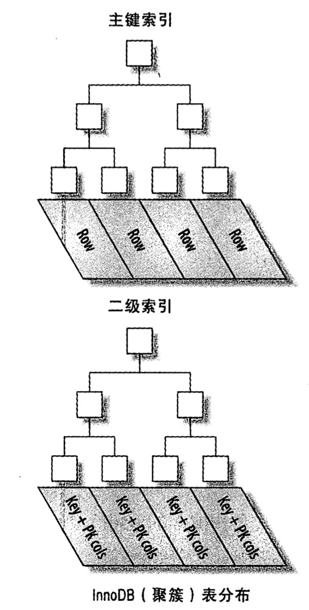

* 在建表的时候，有时候会遇到下面说的情况，一样东西可以存在于多个平台，用1，2，3，4，5代替，如果用一个字段来存的话，由于mysql最近才支持list，必须存成JSON字符串，这样会有一个问题，不能对单一平台进行filter，大大降低了查询的效率，在之前的项目中，有多少个平台，我们就需要存多少列，才能满足filter的需求，其实换个角度来想，这个问题完全可以用二进制的思想来解决，将每一个平台理解为二进制的一位，00000，00100类似的，这样需要按平台查找的时候，对列进行相应位的与操作，就能够filter出来，非常巧妙

* 在写sql的时候，遇到and, order by, group by之类的多行联合操作的时候，需要想到联合索引这个东西，多个单列索引是没有效果的，mysql会自己选择一个它认为最合适的单列索引，可以使用explain命令帮助分析sql语句

    [MySQL单列索引和组合索引的选择效率与explain分析](https://blog.csdn.net/xtdhqdhq/article/details/17582779)

* 记录一次抽奖活动的db处理方法: 用户侧的产品对性能有一定的要求，针对一款礼包，假设给出恒定数量的礼包码，如何优雅的应对高并发的请求

    数据是存储在mysql中的，然而mysql的IO性能不可能hold住这种场景，更不用说要考虑加锁的事了(多个请求在mysqlIO过程中很容易抽到相同的礼包码)，redis是将数据放到内存中的，读写速度是可以保障的，并且redis实例是单进程单线程的，可以将并行的http请求同步化，保证了数据的一致性，礼包码和礼包存放在一张表里，由于primary key的id是自增的，因此是顺序的，我们按照这个顺序将所有id放入一个list中，存放到redis中，redis中限额抽完后，再统一存入mysql持久化

* emoji表情入库方法

    * 如果不做任何处理，db字段是text或varchar的话，emoji表情是不能正常存库的，可以让前端整体encode一下，取出的时候decode一下
    * 修改数据库charset，数据库表、字段的编码方式，utf8 => utf8mb4 [参考文档](https://www.cnblogs.com/janehoo/p/5359800.html)

* 联表查询的时候，经常会出现某个表的字段为null的情况(例如full join)，这个时候，在最外层的select，有时候需要if-else的逻辑，下面是写法

    ```
    select
        IF (
            table1.param1 is not null,
            table1.param1,
            table2.param1
        ) as param1

    ...

    ```

* 当在sql中创建了多个索引的时候，mysql会选择一个它认为最佳的索引，但是你可以fouse或者ignore index
* mysql的水平，垂直分表，水平分表是将不同的用户落到不同的表中用来减轻单表的压力，最简单的方法，就是uid % 16，这样就能将用户分到16个用户表中，垂直分表是将相同的record分到不同的表中，比如订单系统，用户的订单和商家的订单其实是相同的一条记录，但是放在一张表中就显得很冗杂，放到两张表中，必要的时候同步可以采用binlog

* [SQL查询中in和exists的区别分析](https://www.jianshu.com/p/f212527d76ff)

* SQL获取分组的topk

   ```sql
	SELECT
	    *
	FROM
	    game_v v
	WHERE
	    (
	        SELECT
	            count(v1.user_id)
	        FROM
	            game_v v1
	        WHERE
	            v.game_id = v1.game_id
	            and v1.user_id > v.user_id
	    ) < 3
    ```
    
    ```
	SELECT
		t.game_id,
		t.user_name,
		t.game
	from
		(
			select
				v.game_id,
				v.user_id,
				v.user_name,
				v.game,
				@rank := if (@game_id = v.game_id, @rank + 1, 1) as rank,
				@game_id := v.game_id
			from
				game_v v,
				(
					select
						@rank := 1,
						@game_id := null
				) tmp
			order by
				game_id,
				user_id desc
		) t
	where t.rank < 4;
    ```
    
    上面的两个sql都可以取出每个game_id的前几个user_id，第二种写法比较快

* 哈希(hash)比树(tree)更快，索引结构为什么要设计成树型?

    加速查找速度的数据结构，常见的有两类:

        * 哈希，例如HashMap，查询/插入/修改/删除的平均时间复杂度都是O(1)
        * 树，例如平衡二叉搜索树，查询/插入/修改/删除的平均时间复杂度都是O(lg(n))

    可以看到，不管是读请求，还是写请求，哈希类型的索引，都要比树型的索引更快一些，那为什么，索引结构要设计成树型呢？

    因为和SQL的需求有关

    对于这样一个单行查询的SQL需求:

    ```
    select * from t where name = "hh";
    ```

    确实是哈希索引更快，因为每次都只查询一条记录，因此如果
业务需求都是单行访问，例如passport，确实可以使用哈希索引，但是innodb并不支持哈希索引

    但是对于排序查询的SQL需求，例如分组group by、排序sort by以及比较<, >等操作，哈希型的索引，时间复杂度会退化为O(n)，而树型的“有序”特性，依然能够保持O(log(n))的高效率

* B+树和B树一样，都是m叉搜索树，B+树在B树的基础上，做了一些改进:
    
    * 非叶子节点不再存储数据，数据只存储在同一层的叶子节点上，B+树中根到每一个节点的路径长度一样，而B树不是这样
    * 叶子之间，增加了链表，获取所有节点，不再需要中序遍历
    
    这些改进让B+树比B树有更优的特性:

        * 范围查找，定位min与max之后，中间叶子节点，就是结果集，不用中序回溯，范围查询在SQL中用得很多，这是B+树比B树最大的优势
        * 叶子节点存储实际记录行，记录行相对比较紧密的存储，适合大数据量磁盘存储；非叶子节点存储记录的PK，用于查询加速，适合内存存储
        * 非叶子节点，不存储实际记录，而只存储记录的KEY的话，那么在相同内存的情况下，B+树能够存储更多索引

* 量化说下，为啥m叉的B+树比二叉搜索树的高度大大大降低？

    mysql5.6的节点默认是16K，索引走bigint默认是8字节，再加上8字节指向下一层的指针，也就是16字节一个key，mysql默认16k只会写15k，再加上一个节点需要1k空间来放置其他的东西，也就是14k的空间，14 * 1024 / 16 = 896, 896 ^ 3等于7亿多，所以mysql单表扛亿级记录没有压力
    
* mysql的联合索引以及最左原则

    * [MySQL高级 之 order by、group by 优化](https://blog.csdn.net/wuseyukui/article/details/72627667)
    * [mysql组合索引与字段顺序](https://www.cnblogs.com/sunss/archive/2010/09/14/1826112.html)

* Redis最佳实践

    * 避免大key

        * string value < 10KB
        * hash/set/zset元素 < 5000

    * 避免使用长时间阻塞的命令

        * 禁用keys/flushall等命令
        * 在使用命令前，先查看每个命令的时间复杂度 https://redis.io/commands
        * hgetall等遍历命令用hscan代替

    * 避免过热的key
    
        * 将对一个key的请求qps降低到1k以下，通过拆key达到

* 一些 B-Tree 索引的限制，用 （last\_name, first\_name, birthday) 这样一个联合索引举例

    * 如果不是按照索引的最左列开始查找，则无法使用索引。例如上面的索引无法用于查找名字为 Bill 的人，也无法查找某个特定生日的人，因为两列都不是最左数据列。类似的，也无法查找姓氏以某个字母结尾的人

    * 不能跳过索引中的列，也就是说，前面所述的索引无法用于查找姓为 Smith 并且在某个特定日期出生的人。如果不指定 first\_name，则 MySQL 只能使用索引的第一列

    * 如果查询中有某个列的范围查询，则其右边的所有列都无法使用索引优化查找

* 多列联合索引的列顺序如何设置：

    经验之谈：将索引选择性高的列放在前面，索引的选择性是指，不重复的索引数（也称为基数)和数据表的记录总数（#T）的比值，范围从1/#T到1之间

    ```
    count(distinct column) / count(count)
    ```

* innodb 的聚簇索引

    innodb 引擎会为 primary key 建立聚簇索引，索引的叶子节点存储全行的数据，二级索引的叶子结点存储的是 primary key 的值

    

* 推荐给 mysql 的表都建立一个自增的（不一定需要有实际意义）的主键，这样在插入的时候，mysql 知道将新插入的 record 放到之前最后一条的后面，避免频繁 IO，分页出现碎片，能够大大优化时间和空间的使用

* innodb 索引的冗余问题

    当建立 (A, B) 这样的联合索引之后，再建 (A) 的单列索引就是冗余的，因为 A 满足最左匹配，而 (A, ID) 这样的联合索引也是冗余的，因为 (A) 的二级索引包含指向 ID 的指针

* explain 各字段的含义

	* id，id 用于标识 select
	* select\_type，select\_type 用于显示对应行是简单还是复杂 select，simple 意味着查询不包括子查询和 union，如果查询有任何复杂的子部分，则最外层部分标记为 primary
		* subquery，包含在 select 列表中的子查询
		* derived，包含在 from 中的子查询
		* union，在 union 中的第二个和随后的 select 被标记为 union
		* union result，union 的结果
		* 此外，subquery 和 union 还可以被标记为 dependent 和 uncacheable，dependent 意味着 select 依赖于外层查询中发现的数据，uncacheable 意味着 select 中的某些特性阻止结果被缓存，例如临时变量
	* table，显示了对应 select 访问的表名，也可以是 alias
	* type，显示 mysql 如何查找表中的行
		* all，扫全表
		* index，类似于 all，只是 mysql 扫描表的时候按索引次序进行而不是行
		* range，范围扫描，是一个有限制的索引扫描
		* ref，一种索引访问，返回所有匹配某个单个值的单行，这类索引访问只有当使用非唯一性索引或唯一性索引的非唯一性前缀时才会发生，把它叫做 ref 是因为索引要跟某个参考值相比，这个参考值或者是一个常数，或者是来自多表查询前一个表里的结果值
		* eq_ref，使用这种索引查找，mysql 知道最多返回一条符合条件的记录，这种访问方法可以在 mysql 使用主键或唯一性索引查找时看到
		* const, system，mysql 能对查询的某部分进行优化并将其转换为一个常量时，就会使用这些访问类型
	* possible\_keys，查询可能使用的索引
	* key，查询真正使用的索引
	* key\_len，使用索引的长度，联合索引只用了前面部分的话只会算使用部分的子节总数
	* ref，显示了之前的表在 key 列记录的索引中查找值所用的列或常量
	* rows，为了得到查询结果，mysql 扫了多少行记录
	* Extra，包含不适合出现在其他列中的额外信息
		* using index，使用 mysql 的覆盖索引
		* using where，意味着 mysql 服务器将在检索行后再进行过滤
		* using filesort，mysql 会对结果使用一个外部索引排序，而不是按索引次序从表里读取行
		* using temporary，mysql 在对查询结果排序的时候会使用一个临时表
	
* [mysql 延迟关联](http://www.ywnds.com/?p=5128)，如果应用不需要提供页码，则记录上次查询最大的 id，where id > last\_id limit 20 就行了
	
* mysql 优化关联查询

    * 确保 on 的列上有索引。在创建索引的时候就要考虑到关联的顺序，当表 A 和表 B 用列 c 关联的时候，如果优化器的关联顺序是 B、A，那么就不需要在 B 表的对应列上建索引，没有用的索引只会带来额外的负担，一般来说，只需要在关联顺序的第二个表的相应列上建立索引
    * 确保任何的 group by 和 order by 中的表达式只涉及到一个表中的列，这样 mysql 才有可能使用索引来优化这个过程

* mysql 的 MVVC

    innodb 中通过 B+ 树作为索引的数据结构，并且主键所在的索引为 ClusterIndex(聚簇索引), ClusterIndex 中的叶子节点中保存了对应的数据内容。一个表只能有一个主键，所以只能有一个聚簇索引，如果表没有定义主键，则选择第一个非 NULL 唯一索引作为聚簇索引，如果还没有则生成一个隐藏 id 列作为聚簇索引。除了 Cluster Index 外的索引是 Secondary Index(辅助索引)，辅助索引中的叶子节点保存的是聚簇索引的叶子节点的值 + pk index。
    
    innodb 行记录中存在三个隐藏字段，6字节的 db\_trx\_id，表示最新修改该行的事务 id，7字节的 db\_roll\_ptr，执行 undo segment 中的 undo log，用于数据可见性的判断和数据回滚，以及 6 字节的 db\_row\_id，用于缺少 pk 的时候自动生成 pk，如果存在 pk，db\_row\_id 存在于 pk 中。
    
    Undo log 分为 Insert 和 Update 两种，delete 可以看做是一种特殊的 update，即在记录上修改删除标记。update undo log 记录了数据之前的数据信息，通过这些信息可以还原到之前版本的状态。当进行插入操作时，生成的 Insert undo log 在事务提交后即可删除，因为其他事务不需要这个undo log。进行删除修改操作时，会生成对应的 undo log，并将当前数据记录中的 db\_roll\_ptr 指向新的undo log。
    
    read view，或者说 快照 snapshot 是用来存储数据库的事务运行情况，一个事务快照的创建过程可以概括为：查看当前所有的未提交并活跃的事务，存储在数组中，选取未提交并活跃的事务中最小的XID，记录在快照的xmin中，选取所有已提交事务中最大的XID，加1后记录在xmax中。在 RR（repeatable read）级别的隔离中, 事务在begin/start transaction之后的第一条select读操作后, 会创建一个快照(read view), 将当前系统中活跃的其他事务记录记录起来，而在（read commit）级别的隔离中，事务中每条select语句都会创建一个快照(read view)。
    
    下面介绍一下 RR（repeatable read）隔离级别的数据可见性判断：设要读取的行的最后提交事务 id 为 trx\_id\_current，当前事务的 id 为 new\_id，当前事务创建的快照 read view 中最早的事务 id min\_id，最迟的事务 id max\_id（注意这个 max\_id 为 read view 中最大的 id + 1）
    1. trx\_id\_current < min\_id，这种情况比较好理解, 表示, 新事务在读取该行记录时, 该行记录的稳定事务ID是小于系统当前所有活跃的事务, 所以当前行稳定数据对新事务可见, 跳到步骤5
    2. trx\_id\_current >= max\_id, 这种情况也比较好理解, 表示, 该行记录的稳定事务id 是在本次新事务创建之后才开启的, 但是却在本次新事务执行第二个 select 前就 commit 了，所以该行记录的当前值不可见, 跳到步骤4
    3. min\_id <= trx\_id\_current < max\_id, 表示: 该行记录所在事务在本次新事务创建的时候处于活动状态，从 min\_id 到 max\_id 进行遍历，如果 trx\_id\_current 等于他们之中的某个事务 id 的话，那么不可见, 跳到步骤4, 否则表示可见，跳到步骤5
    4. 从该行记录的 DB\_ROLL\_PTR 指针所指向的回滚段中取出最新的 undo-log 的版本号, 将它赋值该 trx\_id\_current，然后跳到步骤1重新开始判断
    5. 将该可见行的值返回

* mysql record lock 锁的是 pk，如果 pk 不存在，锁的是自动创建的 db\_row\_id

* RC 级别下，update 操作会在 where 之后就将不符合条件的行释放锁，而 RR 级别会在整个操作完成之后再释放

* Mysql 默认使用 MVCC 来 read，不用上锁，也可以显式给 select 操作加上 share lock

    ```
    select ... lock in share mode

    select ... for update
    ```

* Mysql 的幻读问题

    幻读：在一次 transaction 中，不同时候相同的 query 得到不同的结果 
    
    ```
    SELECT * FROM child WHERE id > 100 FOR UPDATE;

    INSERT INTO child values (101);
    ```    

    使用 gap lock 或者 next-key lock 锁住 gap，防止其他 transaction 在本次 transaction 未 commit 时插入数据 

* Mysql 的脏读问题

    事务 A 读到未提交事务 B 修改的数据，如果此时事务 B 中途执行失败回滚，那么此时事务 A 读取到的就是脏数据。比如事务 A 对 money 进行修改，此时事务 B 读取到事务 A 的更新结果，但是如果后面事务 A 回滚，那么事务 B 读取到的就是脏数据，在 Mysql 中，只有 RU 下，会发生脏读的问题

* Mysql 死锁不会被隔离级别所影响，因为隔离级别改变的是读操作的行为，然而死锁是由于写操作导致的，下面给出一个死锁的例子

    ```
    tx1

    start transaction;
    select * from t where i = 1 lock in share mode;

    tx2
    
    start transaction;
    delete from t where i = 1;

    tx1

    delete from t where i = 1;
    ```

    首先事务1给 record 加上共享锁，事务2想要删除，所以想要加上排他锁，事务2等待，然后事务1也想删除，这个时候就发生死锁了，因为事务1并不能将共享锁升级为排他锁

* 如何最小化处理死锁

    * 使用 SHOW ENGINE INNODB STATUS 命令去查询最近一次死锁的信息，作出相应的改变
    * 如果死锁频繁发生的话，启用 innodb\_print\_all\_deadlocks 配置选项，可以查看全部的死锁信息，不止最后一条，全面的进行分析
    * 代码层面进行 retry
    * 一次事务里尽量少的请求
    * 建立合适的索引优化查询，减少上锁的行数，加速 lock release 的速度
